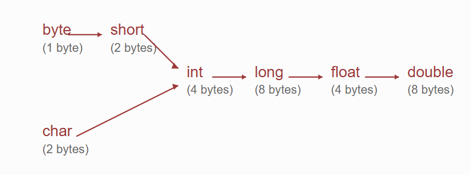

## **Literals in Java**
- A **literal** is any constant value assigned to a variable.
- Example:
  ```java
  int x = 10; 
  ```
  - Here, `10` is a **literal**.
  - `x` is a **variable**.
  - `int` is a **data type**.

---

### **Integer Literal Representations**
For **integer data types** (`int`, `short`, `long`, `byte`), literals can be written in different number systems:

1. **Decimal (Base 10)**  
   - Uses digits `0-9`.  
   - Example values: `10, 20, 30`.  
   - **Valid Declaration:**  
     ```java
     int x = 10;  // Valid
     ```

2. **Octal (Base 8)**  
   - Uses digits `0-7`.  
   - The number must start with `0`.  
   - Example values: `07, 010, 020`.  
   - **Valid Declaration:**  
     ```java
     int x = 010; // Represents 8 in decimal
     ```

3. **Hexadecimal (Base 16)**  
   - Uses digits `0-9` and letters `A-F` (case insensitive).  
   - The number must start with `0x` or `0X`.  
   - Example values: `0x10, 0X20, 0x30`.  
   - **Valid Declarations:**  
     ```java
     int x = 0x10; // Represents 16 in decimal
     int y = 0X10; // Also represents 16 in decimal
     ```
   - Hexadecimal literals are **case-insensitive**, so `0xFace` and `0XFACE` mean the same thing.

---

### **Valid and Invalid Declarations**
```java
int x = 10;       // Valid
int x = 0783;     // Invalid: Octal numbers cannot contain 8 or 9
int x = 0777;     // Valid (Octal representation)
int x = 0xFace;   // Valid (Hexadecimal representation)
int x = 0XBee;    // Valid (Hexadecimal representation)
int x = 0XBeer;   // Invalid: 'r' is not a valid hexadecimal digit
```

---

### **Question: What will be the output of the following Java program?**

```java
class Test {
    public static void main(String[] args) {
        int x = 10;   // Decimal
        int y = 010;  // Octal
        int z = 0x10; // Hexadecimal
        
        System.out.println(x + "..." + y + "..." + z);
    }
}
```

---

### **Explanation:**
In Java, integer literals can be represented in different formats:

1. **Decimal (Base 10)**  
   - `int x = 10;` → `10` in decimal.

2. **Octal (Base 8)**  
   - `int y = 010;`  
   - The prefix `0` indicates an **octal** number.  
   - `010` in octal is converted to decimal as:  
     $$
     0 \times 8^0 + 1 \times 8^1 = 8
     $$
   - So, `y = 8` in decimal.

3. **Hexadecimal (Base 16)**  
   - `int z = 0x10;`  
   - The prefix `0x` indicates a **hexadecimal** number.  
   - `0x10` in hexadecimal is converted to decimal as:  
     $$
     0 \times 16^0 + 1 \times 16^1 = 16
     $$
   - So, `z = 16` in decimal.

### **Output:**
```
10...8...16
```

### **Note:**  
The programmer has the choice to specify values in **decimal, octal, or hexadecimal**, but the **JVM will always print the output in decimal format**.


### **Integer Literals and Their Types**
By default, an **integer literal** in Java is of type `int`. However, we can explicitly specify a **long** type by suffixing the literal with `l` or `L`.

#### **Examples of Integer Literals:**
```java
int x = 10;    // Decimal
int y = 010;   // Octal
int z = 0x10;  // Hexadecimal
```

#### **Explicitly Specifying Long Type:**
```java
long l1 = 10l;   // Valid (long type)
long l2 = 10L;   // Valid (long type)
long l3 = 0x10L; // Valid (hexadecimal long)
long l4 = 010L;  // Valid (octal long)
```

#### **Invalid Assignments:**
```java
int x = 10L;    // Invalid: possible loss of precision (long cannot be assigned to int)
long l = 10;    // Valid: int can be assigned to long (implicit widening)
```

---

### **Byte and Short Assignments**
Although there is **no direct way** to specify `byte` or `short` literals, the **compiler automatically treats integer literals as `byte` or `short` if they are within the valid range**.

#### **Valid Assignments:**
```java
byte b1 = 10;     // Valid (within byte range: -128 to 127)
short s1 = 10;    // Valid (within short range: -32,768 to 32,767)
```

#### **Invalid Assignments (Out of Range):**
```java
byte b2 = 128;    // Compile-time error: possible loss of precision
short s2 = 32768; // Compile-time error: possible loss of precision
```

#### **Example of Implicit Type Casting:**
```java
byte b3 = 127;    // Valid (127 is within byte range)
byte b4 = 128;    // Compile-time error: int value 128 is out of byte range

short s3 = 32767; // Valid (within short range)
short s4 = 32768; // Compile-time error: int value 32768 is out of short range
```

- By default, integer literals are of **int type**.
- We can **explicitly specify long type** by suffixing with `l` or `L`.
- Assigning a **long value to an int variable** results in a **compile-time error**.
- If an integer literal fits within the range of `byte` or `short`, the compiler **automatically treats it as such**.
- If an integer literal **exceeds** the range of `byte` or `short`, a **compile-time error occurs**.

---

### **Floating Point Literals**

By default, a **floating-point literal** in Java is of **double type**. However, we can explicitly specify it as **float** by suffixing the value with `f` or `F`.

---

### **Valid and Invalid Declarations**

#### **By Default, Floating-Point Literals are of Double Type**
```java
double d1 = 1054.5234;  // Valid (default type is double)
double d2 = 1054.5234d; // Valid (explicit double type)
double d3 = 1054.5234D; // Valid (explicit double type)
```

#### **Assigning Floating-Point Literals to Float**
```java
float f1 = 1054.5234;   // Invalid: possible loss of precision (double cannot be assigned to float)
float f2 = 1054.5234f;  // Valid (explicitly specified as float)
float f3 = 1054.5234F;  // Valid (explicitly specified as float)
```

#### **Explicit Float and Double Type Assignment**
```java
float f4 = 123.456f;   // Valid
double d4 = 123.456;   // Valid (default type is double)
double d5 = 123.456D;  // Valid (explicitly specified as double)
double d6 = 123.456d;  // Valid (explicitly specified as double)
```

#### **Invalid Assignment of Double to Float**
```java
float f5 = 1234.567d;  // Invalid: possible loss of precision (double assigned to float)
```

---

### **Floating-Point Literal Representation**
- Floating-point literals can be specified **only in decimal form**.
- **Octal or hexadecimal representations are not allowed** for floating-point literals.

```java
double d1 = 123.456;     // Valid
double d2 = 0123.456;    // Valid (decimal, NOT octal)
double d3 = 0x123.456;   // Invalid: Compiler error (hexadecimal floating point is not allowed)
```

---

### **Example: Floating-Point Literal Execution**
```java
class Test {
    public static void main(String[] args) {
        double d = 0123.456;  // Treated as decimal, not octal
        System.out.println(d); // Output: 123.456
    }
}
```

- **By default, floating-point literals are of type double**.
- **To explicitly specify float**, suffix the literal with `f` or `F`.
- **Double values can be explicitly specified** using `d` or `D`, though it is not required.
- **Floating-point literals must be in decimal format**; **octal and hexadecimal floating-point literals are not allowed**.

---

## **Assignment of Integer and Floating-Point Literals in Java**

- **An integer literal can be assigned to `float` or `double` type**.
- **A floating-point literal cannot be assigned to an `int` type**.
- **Integer literals can be specified in decimal, octal, or hexadecimal form**.

---

### **Valid and Invalid Assignments**

#### **Assigning Integer Literals to Floating-Point Types**
```java
double d1 = 10;     // Valid (integer assigned to double)
double d2 = 0777;   // Valid (octal integer assigned to double)
double d3 = 0xFace; // Valid (hexadecimal integer assigned to double)
```

#### **Invalid Assignments**
```java
int x = 10.5;    // Invalid: floating-point value cannot be assigned to int
int y = 123.0;   // Invalid: floating-point value cannot be assigned to int
```

#### **Floating-Point Literals in Different Forms**
```java
double d4 = 10.0;    // Valid (decimal floating-point)
double d5 = 0786.0;  // Valid (decimal floating-point)
double d6 = 0xFace;  // Valid (hexadecimal integer assigned to double)
```

#### **Invalid Floating-Point Representation**
```java
double d7 = 0XFace.0;  // Invalid: hexadecimal floating-point is not allowed
```

---

### **Example: Assigning Integer and Floating-Point Values**
```java
class Test {
    public static void main(String[] args) {
        double d = 10;
        System.out.println(d); // Output: 10.0
    }
}
```

- **Integer literals can be assigned to `double` or `float`**.
- **Floating-point literals cannot be assigned to `int`**.
- **Integer literals can be specified in decimal, octal, or hexadecimal form**.
- **Floating-point literals must be in decimal format**; hexadecimal floating-point values are not allowed.
---


### **Floating-Point Literals in Exponential Form**

- In Java, **floating-point literals can be specified in scientific notation (exponential form)**.
- The format is:  
  ```
  [coefficient] e [exponent]
  ```
  - `e` or `E` represents **"10 raised to the power"**.
  - The coefficient is a **floating-point number**.
  - The exponent is an **integer** indicating the power of 10.

---
### **Floating-Point Literals in Scientific Notation**

Floating-point literals can be represented in **scientific notation** using `e` or `E`, which denotes **"10 raised to the power"**.  
By default, such literals are of **double type**. To explicitly specify them as `float`, suffix the literal with `f` or `F`.

---

```java
// Valid double assignments in scientific notation
double d1 = 1.2e3;    // Valid → 1.2 * 10^3 = 1200.0
double d2 = 2.5e2;    // Valid → 2.5 * 10^2 = 250.0
double d3 = 3.6E-2;   // Valid → 3.6 * 10^(-2) = 0.036
double d4 = 4E3;      // Valid → 4 * 10^3 = 4000.0
double d5 = 5e2;      // Valid → 5 * 10^2 = 500.0
double d6 = 7E-3;     // Valid → 7 * 10^(-3) = 0.007
double d7 = 1.5E4;    // Valid → 1.5 * 10^4 = 15000.0
double d8 = 2.8e-5;   // Valid → 2.8 * 10^(-5) = 0.000028

// Invalid case: Assigning double to float without explicit 'f' suffix
float f1 = 1.2e3;     // Invalid → Compile-time error: possible loss of precision
float f2 = 1.2e3f;    // Valid → 1200.0
// Invalid case: Scientific notation with hexadecimal (not allowed)
double d9 = 0x1.2p3;  // Invalid → Compile-time error
// Valid scientific notation using binary exponent notation (allowed in Java)
double d10 = 0x1.2p3; // Valid → 1.2 * 2^3 = 9.0
// Valid but unnecessary explicit double notation
double d11 = 123.456D; // Valid → Explicit 'D' is optional
// Invalid case: Scientific notation in octal (not allowed)
double d12 = 0123.456; // Invalid → Compile-time error
// Valid assignments for decimal floating-point values
double d13 = 1.2e3;    // Valid → 1200.0
float f3 = 1.2e3f;     // Valid → 1200.0
```

```java
int x = 0; 

if (x) {  //incompatible types: int cannot be converted to boolean 
    System.out.println("Hello"); 
} else {
    System.out.println("Hi"); 
}
while (true) {  
    System.out.println("Hello"); 
}
```


---
## **Char Literals**

A **char literal** represents a single character and must be enclosed in single quotes. There are several ways to specify a char literal:

### **1. Direct Character Specification**
- **Valid Example:**
```java
char ch = 'a'; // Valid: 'a' is a character literal.
```
- **Invalid Examples:**
```java
char ch = a';    // Invalid: Missing the opening single quote.
char ch = "a";   // Invalid: Double quotes denote a String, not a char.
char ch = 'ab';  // Invalid: A char literal must contain exactly one character.
```

---

### **2. Integral Literal Specification**
A char literal can be specified as an **integral literal** representing the Unicode value. The integral literal can be in **decimal, octal, or hexadecimal** form.

**Allowed Range:** 0 to 65535.

- **Valid Examples:**
```java
char ch1 = 97;         // Valid: 97 corresponds to 'a'.
System.out.println(ch1); // Output: a

char ch2 = 0xFace;      // Valid: Hexadecimal literal.
System.out.println(ch2); // Output: Character corresponding to Unicode 0xFACE

char ch3 = 65535;       // Valid: Maximum allowed value.
```
- **Invalid Example:**
```java
char ch4 = 65536;       // Invalid: 65536 is out of range (0 to 65535).
```

---

### **3. Unicode Escape Representation**
A char literal can also be represented using a **Unicode escape sequence** in the format `'\uxxxx'`, where `xxxx` is a 4-digit hexadecimal number.

- **Example:**
```java
char ch = '\u0041';   // Valid: Represents 'A' (Unicode 65 in decimal).
System.out.println(ch); // Output: A
```
- **Note:** A proper Unicode escape must have exactly four hexadecimal digits.  
  Example: `'\u00061'` is incorrect.

---

### **4. Escape Characters**
Every **escape sequence** is a valid char literal. Common escape sequences include:

| **Escape Character** | **Description**        |
|----------------------|------------------------|
| `\n`                | New Line               |
| `\t`                | Horizontal Tab         |
| `\r`                | Carriage Return        |
| `\b`                | Back Space             |
| `\f`                | Form Feed              |
| `\'`                | Single Quote           |
| `\"`                | Double Quote           |
| `\\`                | Backslash              |

- **Valid Examples:**
```java
char newline = '\n';    // New Line
char tab = '\t';        // Horizontal Tab
char backspace = '\b';  // Back Space
char formfeed = '\f';   // Form Feed
char singleQuote = '\''; // Single Quote
char doubleQuote = '\"'; // Double Quote
char backslash = '\\';  // Backslash
```
- **Invalid Example:**
```java
char invalid = '\m';    // Invalid: '\m' is not a recognized escape sequence.
```

---

### **5. Examples of Using Escape Characters**
```java
System.out.println("This is a backslash: \\");  // Prints: This is a backslash: \
System.out.println("This is a double quote: \""); // Prints: This is a double quote: "
System.out.println("This is a newline:\nNew Line starts here");
// Prints:
// This is a newline:
// New Line starts here
```

---

## **Question: Validity of Character Declarations in C**
Determine which of the following character declarations are **valid**.

| **Declaration**         | **Validity**                                  |
|-------------------------|----------------------------------------------|
| `char ch = 65536;`      | **Invalid**: 65536 is out of range (0 to 65535). |
| `char ch = '0XBer';`    | **Invalid**: A char literal must contain exactly one character. |
| `char ch = '\uface';`   | **Valid**: Correct Unicode escape representation. |
| `char ch = '\Ubee';`    | **Valid**: Assuming C’s universal character names (not valid in Java). |
| `char ch = 'm';`        | **Valid**: Direct character literal. |
| `char ch = '\iface';`   | **Invalid**: `\i` is not a valid escape sequence. |
---


Here is your properly formatted Markdown document:  

```md
## **String Literals**

A **string literal** is any sequence of characters enclosed in double quotes.  
Example:
```java
String s = "durga";  // Valid string literal
```

---

## **Java 1.7 Enhancements for Literals**

### **1. Binary Literals**
Java 1.7 introduced **binary literals** for integral data types.

- **Allowed Digits:** `0` and `1`
- **Prefix Requirement:** `0b` or `0B` must be used.

#### **Examples**
```java
int x = 0B111;  // Binary representation of decimal 7
int y = 0b011;  // Binary representation of decimal 3
```

For **integral data types**, we can specify literals in the following ways:
1. **Decimal** (Base 10)
2. **Octal** (Base 8)
3. **Hexadecimal** (Base 16)
4. **Binary** (Base 2)

---

## **2. Using Underscore (`_`) in Numeric Literals**
From Java 1.7 onwards, we can use the underscore symbol `_` within numeric literals to improve readability.

#### **Example**
```java
double d1 = 123456.789;       // Normal notation
double d2 = 1_23_456.7_8_9;   // Underscore for readability
double d3 = 123_456.7_8_9;    // Underscore in different positions
```

**Compilation Behavior:**  
The underscore symbols `_` are automatically removed at compile-time.  
So, after compilation, all the above declarations are treated as:
```java
double d = 123456.789;
```

### **Invalid Use Cases**
The underscore `_` can only be placed between digits. Using it incorrectly results in a **compilation error**.
```java
double d = -1_23_456.7_8_9j;  // Invalid: 'j' is not allowed in numeric literals
double d = 1_2_3_4_5_6_7_8_9j;  // Invalid: Same issue as above
double d = 1_23_456.7_8_9;  // Valid: Underscore is correctly placed between digits
```

---

## **Data Type Sizes in Java**

| **Data Type** | **Size (Bytes)** |
|--------------|----------------|
| `byte`       | 1B             |
| `short`      | 2B             |
| `int`        | 4B             |
| `long`       | 8B             |
| `float`      | 4B             |
| `double`     | 8B             |
| `char`       | 2B (stores Unicode) |

---

## **Floating-Point Assignment Behavior**
A **long (8 bytes)** value can be assigned to a **float (4 bytes)** variable because they follow different memory representations internally.

```java
float f = 10L;
System.out.println(f);  // Output: 10.0
```

### **Precision Loss in Floating-Point Assignment**
```java
float f = 10.8f;
System.out.println(f);  // Output: 10.8
```
However, if an integer literal is assigned:
```java
float f = 10;
System.out.println(f);  // Output: 10.0
```
---


