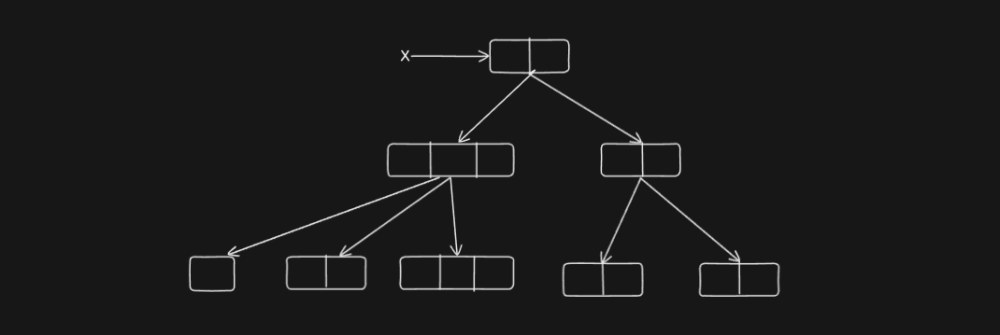
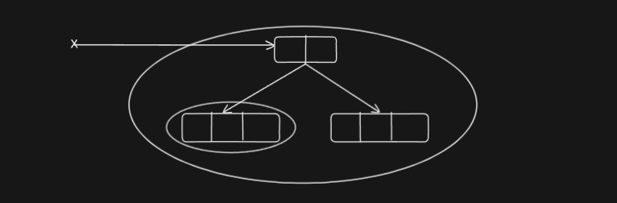
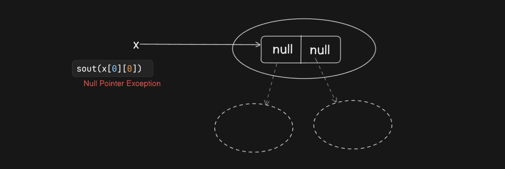

## **Arrays**

An array is an indexed collection of a fixed number of homogeneous data elements.

#### **Advantages of Arrays:**
- We can store multiple values using a single variable, which improves code readability.

#### **Disadvantages of Arrays:**
- Arrays have a fixed size. Once created, the size cannot be increased or decreased based on requirements.
- Since arrays require a predefined size, it may not always be feasible to determine the required size in advance.

---

### **Array Declaration**

#### **One-Dimensional Array Declarations:**
```java
int[] x;  // Recommended for better readability: variable name is clearly separated from type.
int []x;  
int x[];
```

**Incorrect Declaration:**
```java
int[6] x;  // Not possible. Specifying the array size at declaration results in a compile-time error.
```

---

### **Two-Dimensional Array Declarations:**
```java
int[] x;
int[][] x;
int x[][];
int[] x[];
int[][] x;
```

**Valid Declarations:**
```java
int[] a, b;  // Both 'a' and 'b' are one-dimensional arrays.
int[] a[], b;  // 'a' is a two-dimensional array, but 'b' is a one-dimensional array.
int[] a[], b[];  // Both 'a' and 'b' are two-dimensional arrays.
int[][] a, b;  // Both 'a' and 'b' are two-dimensional arrays.
int[][] a, b[];  // 'a' is a two-dimensional array, but 'b' is a three-dimensional array.
```

**Incorrect Declaration:**
```java
int[][] a, []b[];  // Invalid syntax, results in a compile-time error.
int []a []b []c;  // Invalid declaration.
```

#### **Important Note:**
If we specify the dimension before the variable name, that feature is applicable only to the first variable in the declaration. If applied to the remaining variables, it results in a compile-time error.

---

Here is the corrected and properly formatted version:  

---

### **Three-Dimensional Array Declarations**  

- `int[] x[]; a;`  
- `int[][][] x;`  
- `int x[][][];`  
- `int[][][] a;`  
- `int[] a[][];`  
- `int[][] a[];`  
- `int[][][] a;`  
- `int[] []a[];`  
- `int[] []x[] a[];`  
- `int[][] a[];`  
- `int[][][] a[][];`  
- `int[] a[][][];`  

---

## **Arrays as Objects in Java**  

- Every array in Java is an object, so we can create arrays using the `new` operator.  
```java
int[] arr = new int[5];  
```  
- For every array type, corresponding classes are available. However, these classes are part of the Java language and are not accessible at the programmer level.  

- To verify the runtime class of an array:  
```java
class Test {
    public static void main(String[] args) {
        int[] x = new int[3];
        System.out.println(x.getClass().getName());  
    }
}
```  
**Output:**  
```
[I
```  
  - `[I` indicates a one-dimensional integer array.  

```java
class Test {
    public static void main(String[] args) {
        int[][] x = new int[3][2];
        System.out.println(x.getClass().getName());
    }
}
```  
**Output:**  
```
[[I
```  
- `[[I` indicates a two-dimensional integer array.  

---


### **Array Size Declaration**  

1. **Specifying Array Size is Mandatory**  
   - At the time of array creation, specifying the size is compulsory. If the size is not specified, a compile-time error occurs.  

   **Valid Code:**  
   ```java
   int[] x = new int[7];  // Array of size 7 created successfully
   ```  

   **Invalid Code:**  
   ```java
   int[] x = new int();  // Error: Array size missing
   ```  

   **Error Message:**  
   ```
   error: array dimension missing
   int[] x = new int();
   ```

2. **Arrays Can Have Size Zero**  
   - Java allows an array with zero elements, meaning an array of size `0` is valid.  

   **Valid Code:**  
   ```java
   int[] x = new int[0];  // Array with zero elements
   ```  
   - Running this code does not cause any errors.  

3. **Negative Array Size Causes a Runtime Exception**  
   - If a negative value is specified as the array size, the program compiles successfully but throws a runtime exception `NegativeArraySizeException`.  

   **Invalid Code:**  
   ```java
   int[] x = new int[-3];  // Runtime Exception
   ```  

   **Error Message at Runtime:**  
   ```
   Exception in thread "main" java.lang.NegativeArraySizeException
   ```

---

### **Valid Data Types for Array Size**  

4. **Allowed Data Types**  
   - The only allowed data types for specifying an array size are:
     - `byte`
     - `short`
     - `char`
     - `int`  
   - Any other type will result in a compile-time error.  

   **Valid Code:**  
   ```java
   byte b = 20;
   short s = 30;
   char c = 40;
   int[] x1 = new int[b];  // Allowed
   int[] x2 = new int[s];  // Allowed
   int[] x3 = new int[c];  // Allowed
   int[] x4 = new int[10]; // Allowed
   ```

5. **Invalid Data Types (Compile-Time Errors)**  
   - Using `long`, `float`, or `double` for array size results in a compile-time error.  

   **Invalid Code:**  
   ```java
   long l = 100;
   int[] x = new int[l];  // Compile-time error
   ```  

   **Error Message:**  
   ```
   error: incompatible types: possible lossy conversion from long to int
   ```

   **Invalid Code:**  
   ```java
   float f = 5.5f;
   int[] x = new int[f];  // Compile-time error
   ```  

   **Error Message:**  
   ```
   error: incompatible types: possible lossy conversion from float to int
   ```

---

### **Maximum Allowed Array Size in Java**  

6. **Maximum Array Size is `Integer.MAX_VALUE` (`2,147,483,647`)**  
   - Java allows creating an array up to the maximum value of an `int`, which is **2,147,483,647**.  

   **Valid Code:**  
   ```java
   int[] x = new int[2147483647];  // Maximum allowed size
   ```

7. **Exceeding Maximum Size Causes a Compile-Time Error**  
   - If the array size exceeds `Integer.MAX_VALUE`, a compile-time error occurs.  

   **Invalid Code:**  
   ```java
   int[] x = new int[2147483648];  // Compile-time error
   ```  

   **Error Message:**  
   ```
   error: integer number too large
   ```

8. **Even Within Limits, Insufficient Memory May Cause a Runtime Error**  
   - If a valid but large array size is used, a runtime exception `OutOfMemoryError` may occur due to insufficient heap memory.  

   **Example Code That May Fail at Runtime:**  
   ```java
   int[] x = new int[1000000000];  // May cause OutOfMemoryError
   ```  

   **Possible Runtime Error Message:**  
   ```
   Exception in thread "main" java.lang.OutOfMemoryError: Java heap space
   ```

---

### **2D Array Creation in Java**  

In Java, two-dimensional arrays are not strictly implemented using a matrix-like structure. Instead, Java follows the **array of arrays** approach to create multidimensional arrays.  

#### **Advantages of Array of Arrays Approach**  
- **Efficient Memory Utilization**: Since rows can have different lengths, memory usage is optimized.  
- **Flexible Structure**: Unlike traditional matrices, Java allows each row to have a different number of columns, which can be useful in various scenarios.  

#### **Example: Creating a 2D Array**  
```java
int[][] x = new int[2][];  // Declaring a 2D array with 2 rows but no fixed columns

x[0] = new int[4];  // First row has 4 columns
x[1] = new int[5];  // Second row has 5 columns
```
---



### **Jagged Array in Java**  

A **jagged array** is a multidimensional array where each row can have a different number of columns. Java implements multidimensional arrays as arrays of arrays, making jagged arrays possible.  

#### **Example: Creating a Jagged Array**  
```java
public class Test {
    public static void main(String[] args) {
        int[][][] x = new int[2][][];  // 3D array with 2 elements at the first level

        x[0] = new int[3][];  // First element has 3 arrays
        x[0][0] = new int[1]; // First array has 1 element
        x[0][1] = new int[2]; // Second array has 2 elements
        x[0][2] = new int[3]; // Third array has 3 elements

        x[1] = new int[2][2]; // Second element has a 2x2 matrix

        // Assigning values
        x[0][0][0] = 10;
        x[0][1][0] = 20;
        x[0][1][1] = 30;
        x[0][2][0] = 40;
        x[0][2][1] = 50;
        x[0][2][2] = 60;

        x[1][0][0] = 70;
        x[1][0][1] = 80;
        x[1][1][0] = 90;
        x[1][1][1] = 100;
    }
}
```
---


### **Valid and Invalid Array Declarations**  

| **Array Declaration**                 | **Valid / Invalid** | **Reason** |
|---------------------------------------|---------------------|------------|
| `int[] a = new int[];`               | **Invalid**         | Size must be specified. |
| `int[] a = new int[3];`              | **Valid**           | Properly specifies array size. |
| `int[][] a = new int[][];`           | **Invalid**         | Size must be specified for at least the first dimension. |
| `int[][] a = new int[3][];`          | **Valid**           | First dimension is defined, second can be assigned later. |
| `int[][] a = new int[][4];`          | **Invalid**         | First dimension size must be specified. |
| `int[][] a = new int[3][4];`         | **Valid**           | Proper two-dimensional array declaration. |
| `int[][][] a = new int[3][4][5];`    | **Valid**           | Proper three-dimensional array declaration. |
| `int[][][] a = new int[3][4][];`     | **Valid**           | First two dimensions specified, third can be assigned later. |
| `int[][][] a = new int[3][][5];`     | **Invalid**         | Second dimension must be specified before third. |
| `int[][][] a = new int[][4][5];`     | **Invalid**         | First dimension size must be specified. |

In Java, only the **first dimension** of a multidimensional array must be specified at creation time. The other dimensions can be assigned dynamically later.

---


### **1D Array Initialization**  
When you create a 1D array, all elements are automatically set to default values.  

```java
class Test {
    public static void main(String[] args) {
        int[] x = new int[3];  
        System.out.println(x);    // Prints array reference
        System.out.println(x[0]); // Prints default value (0)
    }
}
```

**Output:**
```
[I@6d06d69c   // Memory reference
0             // Default value of int array element
```

---

#### **2D Array Initialization**  
```java
class Test {
    public static void main(String[] args) {
        int[][] x = new int[2][3];  
        System.out.println(x);       // Prints memory reference of 2D array
        System.out.println(x[0]);    // Prints reference of first row
        System.out.println(x[0][0]); // Prints 0 (default value)
    }
}
```

**Output (example memory references):**
```
[[I@5a07e868  // Reference of 2D array
[I@6d06d69c   // Reference of first row (not null)
0             // Default int value
```

- `x` is a **2D array** (`new int[2][3]` means 2 rows, 3 columns).  
- Each row (`x[0]`, `x[1]`) is **automatically created** and filled with `0`.  
- `x[0][0]` accesses an actual integer, which defaults to `0`.  

---

#### **Case That Causes NullPointerException (NPE)**  
```java
class Test {
    public static void main(String[] args) {
        int[][] x = new int[2][];  // Only first dimension initialized
        System.out.println(x[0]);  // Prints null
        System.out.println(x[0][0]);  // Causes NullPointerException
    }
}
```
**Output:**
```
null
Exception in thread "main" java.lang.NullPointerException
```


- `x` is a reference to a **2D array object**.  
- `x[0]` is a reference to the **first row** of the array.  
- `x[0][0]` accesses an **actual element**, which defaults to `0`.





---
### **Understanding 2D Array Initialization in Java**  

#### **Code Example:**  
```java
class Test {
    public static void main(String[] args) {
        int[][] x = new int[2][3];  
        System.out.println(x);       // Reference of 2D array
        System.out.println(x[0]);    // Reference of first row (not null)
        System.out.println(x[0][0]); // Default value (0)
    }
}
```

#### **Expected Output (Example Addresses):**  
```
[[I@3e2505   // Memory reference of 2D array
[I@5a07e868  // Memory reference of first row (not null)
0            // Default value at x[0][0]
```

#### **Key Points:**
1. **`new int[2][3]` automatically initializes values** → Each row is created and filled with `0` (default for `int`).
2. **`x[0]` is NOT null** → It refers to an array `[0, 0, 0]`.
3. **No NullPointerException (NPE)** → `x[0][0]` exists and holds `0`.

---

### **Case That Causes NullPointerException (NPE)**  
```java
class Test {
    public static void main(String[] args) {
        int[][] x = new int[2][];  // Only first dimension initialized
        System.out.println(x[0]);  // null (since second dimension is not allocated)
        System.out.println(x[0][0]);  // Causes NullPointerException
    }
}
```

#### **Output:**
```
null
Exception in thread "main" java.lang.NullPointerException
```

#### **Why?**
- `x = new int[2][];` initializes only the **first dimension**, but **does not allocate memory for rows**.
- `x[0]` is `null`, so `x[0][0]` throws an **NPE**.

---

- `new int[2][3]` → No NPE, values are `0`
- `new int[2][]` → NPE if accessing `x[0][0]` without allocation




---

### **Note**

1. **Null Pointer Exception**  
- If we try to perform any operation on `null`, we will get a runtime exception: `NullPointerException`.

2. **Default Initialization of Arrays**  
- When we create an array, each element is initialized with a default value.  
- If we are not satisfied with the default values, we can override them with our customized values.

```java
int[] x = new int[6];  
```
- Default Initialization:  
```
|0|0|0|0|0|0|
```

- After assigning values:
```java
x[0] = 10;
x[1] = 20;
x[2] = 30;
x[3] = 40;
x[4] = 50;
x[5] = 60;
```
- After updation
```
|10|20|30|40|50|60|
```
3. **Invalid Operations on Arrays**
- **Accessing out-of-bounds indices**  
```java
x[6] = 70;  // Invalid - Runtime Exception: ArrayIndexOutOfBoundsException
x[-6] = 50; // Invalid - Runtime Exception: ArrayIndexOutOfBoundsException
```
- **Using non-integer indices**  
```java
x[2.5] = 344; // Invalid - Compile-time Error: Possible loss of precision
```
- **Reason**: Array indices must be of type `int`. A `double` cannot be used as an index.

4. **Out of Range Index Access**
- If we try to access an index outside the valid range (negative or beyond the array size), we get a **runtime exception**:  
`ArrayIndexOutOfBoundsException`.

---
### **memory representation**

```java
public class ArrayMemoryRepresentation {
    public static void main(String[] args) {
        int[][] x = { {10, 20}, {30, 40, 50} };

        // Accessing elements
        System.out.println(x[0][0]); // 10
        System.out.println(x[0][1]); // 20
        System.out.println(x[1][0]); // 30
        System.out.println(x[1][1]); // 40
        System.out.println(x[1][2]); // 50
    }
}
```
### **Memory Representation Diagram:**

```java
x ----→  [  *  |  *  ]  
            |     |
            |     └───> [ 30 | 40 | 50 ] 
            |
            └───> [ 10 | 20 ] 
```
---

### **1. Declaring, Creating, and Initializing Arrays**

#### **Separate Declaration and Initialization**
```java
int[] x;         // Declare an array reference
x = new int[3];  // Create an array with size 3

// Assign values
x[0] = 2;
x[1] = 3;
x[2] = 4;
```

#### **Single-Line Initialization (Shortcut Representation)**
```java
int[] x = {10, 20, 30};      // Integer array
char[] r = {'a', 'e', 'i', 'o', 'u'};  // Character array
String[] st = {"hi", "durga", "you", "are", "great"}; // String array
```

#### **Incorrect Declaration (Compile-Time Error)**
```java
int[] x;
x = {10, 20, 30}; // Compile-time error: Illegal start of expression
```
**Important Note:**  
- When assigning values separately, the `new` keyword must be used:  
  ```java
  x = new int[]{10, 20, 30};  // Correct
  ```

---

### **2. Multidimensional Arrays**

#### **2D Array Example**
```java
int[][] x = { {10, 20}, {30, 40, 50} };
```

#### **3D Array Example**
```java
int[][][] x = {  
    { {10, 20, 30}, {40, 50, 60} },  
    { {70, 80, 90}, {100, 110, 120} }  
};

// Accessing elements
System.out.println(x[0][1][2]); // Output: 60
System.out.println(x[1][1][1]); // Output: 110
```

#### **Invalid Index Access (Runtime Exception)**
```java
System.out.println(x[1][2][0]); // ArrayIndexOutOfBoundsException
System.out.println(x[0][2][0]); // ArrayIndexOutOfBoundsException
```

**Important Note:**  
- Accessing an index that is out of range in an array will result in `ArrayIndexOutOfBoundsException`.

---

### **3. Memory Representation of Arrays**
#### **1D Array**
```
x → [ 10 | 20 | 30 ]  // Integer array with three elements
```

#### **2D Array**
```
x →  [ *  | *  ]   // Reference to two sub-arrays
       |      |
       |      └───> [ 30 | 40 | 50 ]  // Second sub-array
       |
       └───> [ 10 | 20 ]   // First sub-array
```

#### **3D Array**
```
x →  [ *  | *  ]  
       |      |
       |      └───> [ *  | *  ]  
       |              |      |
       |              |      └───> [100 | 110 | 120]
       |              └───> [ 70 | 80 | 90 ]
       └───> [ *  | *  ]  
              |      |
              |      └───> [ 40 | 50 | 60 ]
              └───> [ 10 | 20 | 30 ]
```

---

### **4. `length` vs. `length()`**
#### **`length` (for Arrays)**
- `length` is a final variable applicable **only for arrays**.
- Represents the **size of the array**.

```java
int[] x = new int[6];
System.out.println(x.length); // Output: 6
System.out.println(x.length()); // Compile-time error: Cannot find symbol
```

#### **`length()` (for Strings)**
- `length()` is a final method applicable **only for String objects**.
- Returns the **number of characters** in the string.

```java
String s = "durga";
System.out.println(s.length()); // Output: 5
System.out.println(s.length); // Compile-time error: Cannot find symbol
```

**Important Notes:**  
- `length` is used for arrays.  
- `length()` is used for strings.

---

### **5. Interview Question: `String.length` vs. `Array.length`**
#### **Question: What is the output of the following code?**
```java
String[] s = {"A", "AA", "AAA"};

System.out.println(s.length); // Outputs: 3
System.out.println(s.lengthc); // Compile-time error
System.out.println(s[0].length); // Compile-time error
System.out.println(s[1].length()); // Outputs: 2
```

#### **Explanation**
1. `s.length` → Returns the number of elements in the array → `3`
2. `s.lengthc` → Error: `lengthc` does not exist.
3. `s[0].length` → Error: Strings do not have a `length` variable.
4. `s[1].length()` → Returns length of `"AA"` → `2`

**Important Notes:**  
- `length` is used for getting the number of elements in an array.  
- `length()` is used for getting the number of characters in a string.  
- Accessing `s[0].length` (where `s[0]` is a string) is incorrect because `length` is not a valid variable for `String`.  
- Correct usage for a string is `s[0].length()`.


---

### **Multidimensional Arrays and `length` Variable**  

In **multidimensional arrays**, the `length` variable represents **only the size of the base array** (i.e., the number of rows), not the total number of elements across all rows.

#### **Example: Understanding `length` in a 2D Array**  
```java
int[][] x = new int[6][3];  // 6 rows, each with 3 columns  

System.out.println(x.length);     // Output: 6 (Number of rows)  
System.out.println(x[0].length);  // Output: 3 (Number of columns in the first row)  
```
- `x.length` → Gives the number of rows (`6`).  
- `x[0].length` → Gives the number of columns in row `0` (`3`).  

#### **Finding the Total Number of Elements**  
There is **no direct method** to get the total number of elements in a multidimensional array. However, we can compute it manually by summing the lengths of all rows.

```java
int totalSize = 0;
for (int i = 0; i < x.length; i++) {
    totalSize += x[i].length;  
}

System.out.println("Total number of elements: " + totalSize); // Output: 18  
```

- `x.length` gives the number of rows.  
- `x[i].length` gives the number of columns in row `i`.  
- The total number of elements in a **jagged array** (where rows may have different lengths) must be computed dynamically using a loop.

---


### **Anonymous Arrays**  

#### **Definition:**  
An **anonymous array** is an array **without a name**, created for **instant use** or **one-time usage**.

#### **Purpose of Anonymous Arrays:**  
- Used when an array is required **only once** and does not need to be stored for later use.  
- Saves memory by avoiding unnecessary variable allocation.  
- Commonly used in method arguments where the array is needed only for computation.

---

### **Declaring an Anonymous Array**  

#### **Example: Passing an Anonymous Array to a Method**
```java
class Test {
    public static void main(String[] args) {
        sum(new int[]{10, 20, 30, 40}); // Anonymous array passed directly
    }

    public static void sum(int[] x) {
        int total = 0;
        for (int num : x) {
            total += num;
        }
        System.out.println("The Sum: " + total); // Output: The Sum: 100
    }
}
```
**Explanation:**  
- `new int[]{10, 20, 30, 40}` is an **anonymous array**.  
- It is created and passed **directly** to the `sum()` method without storing it in a variable.  
- The `sum()` method calculates the sum of all elements.

---

### **Key Rules for Anonymous Arrays**
1. **Cannot specify size explicitly:**  
   ```java
   new int[4]{10, 20, 30, 40};  // Compile-time error
   ```
   - The size is inferred from the number of elements provided.  

2. **Can be used for multidimensional arrays:**  
   ```java
   new int[][]{{10, 20}, {30, 40}};  // Valid
   ```

3. **Losing anonymity by assigning a name:**  
   ```java
   int[] x = new int[]{10, 20, 30};  // Now it is no longer anonymous
   ```

---

### **Use Cases of Anonymous Arrays**
- **Method arguments for quick computations:**  
  ```java
  printArray(new String[]{"Apple", "Banana", "Mango"});
  ```
- **Multidimensional matrix operations:**  
  ```java
  multiplyMatrix(new int[][]{{1, 2}, {3, 4}});
  ```

**Important Note:**  
- Anonymous arrays are mainly used in situations where storing an array is unnecessary.

---

### **Why Use an Anonymous Array?**  

In the previous example, the **`sum` method** requires an array as input. However, after the method execution is complete, we **no longer need** the array.  

For such **one-time use**, an **anonymous array** is the best choice because:  
- It avoids unnecessary memory allocation.  
- It eliminates the need to create and store a named array.  
- It keeps the code clean and efficient.  

#### **Example: Using an Anonymous Array for One-Time Computation**  
```java
class Test {
    public static void main(String[] args) {
        sum(new int[]{10, 20, 30, 40}); // Anonymous array used directly
    }

    public static void sum(int[] x) {
        int total = 0;
        for (int num : x) {
            total += num;
        }
        System.out.println("The Sum: " + total); // Output: The Sum: 100
    }
}
```

#### **Without an Anonymous Array (Unnecessary Extra Step)**  
```java
class Test {
    public static void main(String[] args) {
        int[] arr = {10, 20, 30, 40}; // Creating a named array
        sum(arr); // Passing named array to method
    }

    public static void sum(int[] x) {
        int total = 0;
        for (int num : x) {
            total += num;
        }
        System.out.println("The Sum: " + total);
    }
}
```
**Drawback:** The named array `arr` **remains in memory** even after its one-time use.

#### **Conclusion:**  
- If an array is required **only once**, using an **anonymous array** is a better approach.  
- It helps in writing **concise** and **efficient** code by avoiding unnecessary variables.

---

### **Array Element Assignment Rules**  

#### **Case 1: Primitive Type Arrays**  
When dealing with **primitive type arrays**, the assigned values must be implicitly **promoted** to the declared type.

##### **Example 1: Assigning Compatible Primitive Values**
```java
int[] x = new int[5];

x[0] = 10;   // Integer assigned ✓
x[1] = 'a';  // Character implicitly promoted to int ✓

byte b = 20;
x[2] = b;    // Byte implicitly promoted to int ✓

short s = 30;
x[3] = s;    // Short implicitly promoted to int ✓

x[4] = 10L;  // Error: long cannot be assigned to int (Explicit casting required)
```
##### **Key Rule:**  
For **integer-based arrays** (`byte`, `short`, `char`, `int`), implicit promotion follows this order:

```
byte → short → int → long → float → double  
         \  
          char  
```
- **Allowed:** Assigning `byte`, `short`, `char` to `int`, or `int` to `float`.
- **Not Allowed:** Assigning `long`, `float`, or `double` to `int` without explicit casting.

##### **Example 2: Assigning Values to a `float` Array**
```java
float[] f = new float[3];

f[0] = 10;     // int to float ✓
f[1] = 10.5f;  // float ✓
f[2] = 'A';    // char to float ✓

f[0] = 10.5;   // Error: double cannot be assigned to float (explicit cast required)
```
For **`float[]` arrays**, allowed types are:
```
byte → short → char → int → long → float  
```

---

#### **Case 2: Object Type Arrays**  
When dealing with **object-type arrays**, assigned values must be of the declared type **or its subclasses**.

##### **Example 3: Assigning Objects to an `Object[]` Array**
```java
Object[] a = new Object[3];

a[0] = new Object();       // Object ✓
a[1] = new String("durga"); // String is a subclass of Object ✓
a[2] = new Integer(10);    // Integer is a subclass of Object ✓
```
- **Allowed:** Any subclass of `Object` can be stored in an `Object[]` array.

##### **Example 4: Assigning Objects to a `Number[]` Array**
```java
Number[] n = new Number[3];

n[0] = new Integer(10);  // Integer is a subclass of Number ✓
n[1] = new Double(10.5); // Double is a subclass of Number ✓

n[2] = new String("durga"); 
// Error: String is not a subclass of Number
```
**Hierarchy:**
```
   Number
  / |  |  |  \
 Byte Short Int Long Float Double  
```
- **Allowed:** Any subclass of `Number` (`Integer`, `Double`, `Byte`, etc.).
- **Not Allowed:** Non-`Number` types like `String`.

---

### **Case 3: Interface Type Arrays**  

When dealing with **interface type arrays**, the assigned elements must be **instances of a class that implements the interface**.

#### **Example 1: Assigning Implementation Class Objects to an Interface Array**
```java
Runnable[] r = new Runnable[10];

r[0] = new Thread();  // Thread implements Runnable ✓
r[1] = new String("durga");  
// Error: String does not implement Runnable
```
##### **Hierarchy Representation:**  
```
Runnable (Interface)  
       |  
    Thread (Class)  
```
- **Allowed:** Any object of a class that **implements** `Runnable` can be stored in `Runnable[]`.  
- **Not Allowed:** Objects of classes that do **not** implement `Runnable` (e.g., `String`).  

---

### **Array Type vs. Allowed Element Types**  

| **Array Type**         | **Allowed Element Types** |
|------------------------|--------------------------|
| **Primitive Arrays**   | Any type that can be **implicitly promoted** to the declared type. |
| **Object Type Arrays** | Either the **declared type** or **its child class objects**. |
| **Abstract Class Type Arrays** | Only objects of **its child classes**. |
| **Interface Type Arrays** | Only **objects of classes that implement** the interface. |

#### **Examples:**
##### **1. Primitive Arrays**
```java
int[] x = new int[5];

x[0] = 10;       // int (same type) ✓
x[1] = 'a';      // char (implicitly promoted to int) ✓
byte b = 20;  
x[2] = b;        // byte → int (promotion) ✓
short s = 30;
x[3] = s;        // short → int (promotion) ✓
x[4] = 10L;      // long → int (Not allowed, compile-time error)
```

##### **2. Object Type Arrays**
```java
Object[] objArr = new Object[5];

objArr[0] = new Object();      // Object ✓
objArr[1] = new String("Hi");  // String (child of Object) ✓
objArr[2] = new Integer(10);   // Integer (child of Object) ✓
```

##### **3. Abstract Class Type Arrays**
```java
abstract class Animal {}
class Dog extends Animal {}
class Cat extends Animal {}

Animal[] animals = new Animal[3];
animals[0] = new Dog();  // ✓ Allowed (Dog is a subclass of Animal)
animals[1] = new Cat();  // ✓ Allowed (Cat is a subclass of Animal)
animals[2] = new Animal();  // ✗ Error (Cannot instantiate an abstract class)
```

##### **4. Interface Type Arrays**
```java
interface Runnable {}
class MyThread implements Runnable {}
class AnotherThread implements Runnable {}

Runnable[] runArr = new Runnable[2];
runArr[0] = new MyThread();       // ✓ Allowed
runArr[1] = new AnotherThread();  // ✓ Allowed
runArr[2] = new String("Hello");  // ✗ Error (String does not implement Runnable)
```

---

## **Array Variable Assignments**

#### **Case 1: Element-Level Promotions Not Applicable at Array Level**  

- Example: A `char` element can be promoted to an `int` type, but a `char[]` array cannot be promoted to an `int[]` array.

```java
int[] x = {10, 20, 30, 40};
char[] ch = {'a', 'b', 'c'};

int[] b = x;   // Valid
int[] c = ch;  // Invalid: CE (Compilation Error) - incompatible types
```

#### **Question:**  
Which of the following promotions will be performed automatically?  

| Promotion         | Validity  |
|------------------|----------|
| `char → int`     | Valid    |
| `String → Object` | Valid    |
| `String[] → Object[]` | Valid    |
| `char[] → int[]` | Invalid  |
| `int → double` | Valid    |
| `int[] → double[]` | Invalid  |
| `float → int` | Invalid  |
| `float[] → int[]` | Invalid  |

#### **Object Type Arrays: Child Class Arrays Can Be Promoted to Parent Class Arrays**  

```java
String[] A = {"A", "B", "C"};
Object[] a = A;  // Valid
```

---

#### **Case 2: Array Assignment Copies Only References, Not Elements**  

```java
int[] a = {10, 20, 30, 40, 50, 60};
int[] b = {70, 80};

a = b; // 'a' now references the array {70, 80}
b = a; // 'b' now references the array {70, 80}
```

> **Note:** When one array is assigned to another, the internal elements are not copied—only the reference variable is reassigned.

---

#### **Case 3: Array Dimensions Must Match**  

- If we try to assign a different dimension, a **compilation error** will occur.

```java
int[][] a = new int[3][];

// Invalid assignments
a[0] = new int[3][2];  // CE: Incompatible types
a[0] = 10;             // CE: Incompatible types

// Valid assignment
a[0] = new int[2]; 
```

> **Rule:** Both dimensions and types must match, but sizes do not have to match.

---

### **Command-Line Arguments Example**  

```java
class Test {  
    public static void main(String[] args) {  
        for (int i = 0; i < args.length; i++) {  
            System.out.println(args[i]);  
        }  
    }  
}  
```

#### **Compilation and Execution Commands:**  

```sh
javac Test.java  
java Test A B C  
```

**Output:**  
```
A  
B  
C  
```

```sh
java Test A B  
```
**Output:**  
```
A  
B  
```

```sh
java Test  
```
**Output:** (No output, as no arguments were passed)
```
