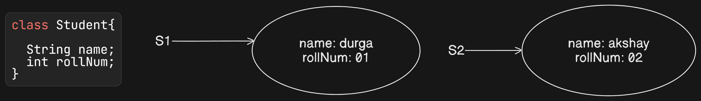

## **Classification of Variables in Java**

### **1. Based on Type of Value Represented**
All variables in Java are categorized into two types based on the type of value they represent:

#### **1.1 Primitive Variables**
- These variables store primitive values such as integers, floating points, characters, and booleans.
- Example:
  ```java
  int x = 10;
  double pi = 3.14;
  char grade = 'A';
  ```

#### **1.2 Reference Variables**
- These variables store references (addresses) to objects.
- Example:
  ```java
  class Student {
      String name;
      int rollNum;
  }
  
  Student s = new Student(); // 's' is a reference variable pointing to a Student object
  ```
- `s` is pointing to the object in heap memory.
---

---

### **2. Based on Position of Declaration and Behavior**
All variables in Java are classified into three types:

1. **Instance Variables**
2. **Static Variables**
3. **Local Variables**

---

## **Instance Variables**
- Instance variables are declared within a class but outside any method, constructor, or block.
- They are created when an object is instantiated and destroyed when the object is destroyed.
- Each object gets its own separate copy of instance variables.

### **Example**
```java
class Student {
    String name;
    int rollNum;
}
```
- If the value of `name` and `rollNum` varies from object to object, then these variables are called **instance variables**.
- For every object, a separate copy is created in **heap memory**.

### **Characteristics of Instance Variables**
- Declared within a class, but outside any method, block, or constructor.
- Created when an object is instantiated and destroyed when the object is destroyed.
- Stored in **heap memory** as part of the object.
- Cannot be accessed directly from a **static context**, but can be accessed via an object reference.
- Can be accessed from instance methods.

---

### **Example: Accessing Instance Variables**
```java
class Test {
    int x = 10; // Instance variable

    public static void main(String[] args) {
        System.out.println(x); // Compilation Error: non-static variable x cannot be referenced from a static context
    }
}
```
**Explanation:**  
- Since `x` is an **instance variable**, it cannot be accessed directly in the `main` method, which is static.

---

### **Correct Way to Access Instance Variables**
```java
class Test {
    int x = 10;

    public static void main(String[] args) {
        Test t = new Test(); 
        System.out.println(t.x); // Output: 10
    }
}
```
- Here, `t.x` accesses the instance variable `x` through an object.

---

### **Accessing Instance Variables from Instance Methods**
```java
class Test {
    int x = 10;

    public static void main(String[] args) {
        Test t = new Test();
        System.out.println(t.x); // Output: 10
    }

    public void m1() {
        System.out.println(x); // Valid, as instance methods can directly access instance variables.
    }
}
```
- The method `m1()` can access `x` directly because it's an **instance method**.

---

### **Instance Variables and Default Values**
- For **instance variables**, the **JVM always provides default values**, so explicit initialization is not required.
- If an instance variable is not initialized, it gets the following default values:

  | Data Type  | Default Value |
  |------------|--------------|
  | `int`      | `0`          |
  | `double`   | `0.0`        |
  | `boolean`  | `false`      |
  | `String` (or any object reference) | `null` |

---

### **Example: JVM Default Values for Instance Variables**
```java
class Test {
    int x;
    double d;
    boolean b;
    String s;

    public static void main(String[] args) {
        Test t1 = new Test();
        System.out.println(t1.x);  // Output: 0
        System.out.println(t1.d);  // Output: 0.0
        System.out.println(t1.b);  // Output: false
        System.out.println(t1.s);  // Output: null
    }
}
```

**Explanation:**
- Since `x`, `d`, `b`, and `s` are instance variables, they are automatically initialized by the JVM.
- **No explicit initialization** is needed.

---

### **Other Names for Instance Variables**
- Instance variables are also known as:
  - **Object-level variables** (since they belong to an object)
  - **Attributes** (when referring to object properties in OOP)
  
---

## **Static Variables in Java**
- If the value of a variable **does not vary from object to object**, then it is **not recommended** to declare it as an instance variable.
- Instead, such a variable should be declared at the **class level using the `static` modifier**.

### **Key Differences Between Instance and Static Variables**
| Instance Variable | Static Variable |
|------------------|----------------|
| Separate copy created for each object | Single copy shared across all objects |
| Declared inside a class but outside any method or block | Declared inside a class but outside any method or block, using `static` keyword |
| Created when an object is instantiated | Created at the time of **class loading** |
| Destroyed when the object is destroyed | Destroyed when the **class is unloaded** |
| Stored in **heap memory** (part of the object) | Stored in the **method area** |

---

### **Example: Instance vs. Static Variables**
```java
class Student {  
    String name;  // Instance variable
    int rollNo;   // Instance variable
    static String course = "DS"; // Static variable
}  

public class Test {
    public static void main(String[] args) {
        Student s1 = new Student();
        s1.name = "Durga";
        s1.rollNo = 101;

        Student s2 = new Student();
        s2.name = "Shina";
        s2.rollNo = 102;

        Student s3 = new Student();
        s3.name = "Ravi";
        s3.rollNo = 103;

        System.out.println(s1.name + " - " + s1.rollNo + " - " + s1.course);
        System.out.println(s2.name + " - " + s2.rollNo + " - " + s2.course);
        System.out.println(s3.name + " - " + s3.rollNo + " - " + s3.course);
    }
}
```
**Output:**
```
Durga - 101 - DS
Shina - 102 - DS
Ravi - 103 - DS
```
- The `course` variable is **static**, so it is shared among all objects of `Student`.

---

### **Execution Steps for a Java Class (`Test.class`)**
1. Start JVM.
2. Create and start the `main` thread.
3. Locate `Test.class` file.
4. **Load `Test.class`** (Static variables are created at this step).
5. Execute the `main` method.
6. **Unload `Test.class`** (Static variables are destroyed at this step).
7. Terminate the `main` thread.
8. Shutdown the JVM.

---

### **Accessing Static Variables**
- We can access **static variables** in **two ways**:
  1. **Using class name (Recommended)**
  2. **Using object reference (Not recommended)**

```java
class Test {
    static int x = 10; // Static variable

    public static void main(String[] args) {
        Test t = new Test();
        System.out.println(t.x);     // Accessing via object (Not recommended)
        System.out.println(Test.x);  // Accessing via class name (Recommended)
    }
}
```

**Output:**
```
10
10
```

---

### **Accessing Static Variables from Static and Instance Areas**
```java
class Test {
    static int x = 10; // Static variable

    public static void main(String[] args) {
        System.out.println(x);  // Direct access within the same class
    }

    public void m1() {
        System.out.println(x);  // Access from instance method
    }
}
```

---

### **Default Values for Static Variables**
- Just like instance variables, the JVM provides **default values** for static variables if they are not explicitly initialized.

```java
class Test {
    static int x;
    static double d;
    static String s;

    public static void main(String[] args) {
        System.out.println(x);  // Output: 0
        System.out.println(d);  // Output: 0.0
        System.out.println(s);  // Output: null
    }
}
```

---

### **Static Variables and Object References**
```java
class Test {
    static int x = 10; // Static variable
    int y = 20;        // Instance variable

    public static void main(String[] args) {
        Test t1 = new Test();
        t1.x = 888;  // Modifies static variable
        t1.y = 999;  // Modifies instance variable

        Test t2 = new Test();
        System.out.println(t2.x + "..." + t2.y); // Output: 888...20
    }
}
```

**Explanation:**
- `x` is **static**, so **only one copy** exists in memory, shared by `t1` and `t2`.  
- `y` is an **instance variable**, so **each object** gets its **own copy**.

---

### **Other Names for Static Variables**
- **Class-level variables**
- **Fields** (common in OOP terminology)

---


## **Local Variables in Java**

#### **1. Definition and Characteristics of Local Variables**
- **Local variables** are variables that are declared **inside a method, block, or constructor** and are used only within that specific block of code.
- These variables are **temporary** and exist only during the execution of the block in which they are declared.
- Local variables are **also known as temporary variables or automatic variables**.
- They are stored in **Stack Memory**, unlike instance and static variables which are stored in Heap and Method Area respectively.
- **Local variables are created when the block is executed** and **destroyed when the block completes** execution.
- **JVM does not provide default values** for local variables. Therefore, they must be **explicitly initialized before use**.

---

### **2. Scope of Local Variables**
- Local variables have **block-level scope**, meaning they are accessible only within the block in which they are declared.
- If a local variable is declared inside a loop or conditional block, it cannot be accessed outside that block.

#### **Example: Scope of Local Variables**
```java
class Test {
    public static void main(String[] args) {
        int i = 0; // Local Variable declared inside the main method
        
        for (int j = 0; j < 3; j++) { // j is a local variable for the loop
            i = i + j; // j is accessible inside the loop
        }
        
        System.out.println(i + "..." + j); // Compilation Error: j is not accessible here
    }
}
```
#### **Explanation**
- Here, `i` is declared inside the `main` method and is accessible throughout the method.
- The variable `j` is declared inside the `for` loop, so its scope is **limited to the loop itself**.
- Trying to access `j` outside the loop results in a **compilation error**, because `j` does not exist beyond the loop.

---

### **3. Local Variables Inside Try-Catch Blocks**
- A variable declared inside a `try` or `catch` block is **limited to that block** and cannot be accessed outside.
- If we need to use the variable outside the block, it must be declared **before** the `try-catch` statement.

#### **Example: Limited Scope in Try-Catch**
```java
class Test {
    public static void main(String[] args) {
        try {
            int j = Integer.parseInt("ten"); // Causes NumberFormatException
        } catch (NumberFormatException e) {
            System.out.println("Error: Cannot convert 'ten' to an integer.");
            int j = 10; // This j is only accessible inside the catch block
        }
        
        System.out.println(j); // Compilation Error: j cannot be accessed here
    }
}
```
#### **Example: Correct Way to Declare a Variable for Use Outside Try-Catch**
```java
class Test {
    public static void main(String[] args) {
        int j; // Declare j before try-catch

        try {
            j = Integer.parseInt("ten"); // Causes NumberFormatException
        } catch (NumberFormatException e) {
            j = 10; // Assign value inside catch
        }

        System.out.println(j); // Output: 10
    }
}
```
#### **Explanation**
- In the first example, `j` is declared inside the `catch` block, making it **unavailable outside the block**.
- In the second example, `j` is **declared before** the `try-catch` block, allowing it to be used in the `catch` block and also outside.

---

### **4. Local Variables Must Be Initialized Before Use**
- Unlike instance and static variables, local variables **do not get default values** from the JVM.
- If a local variable is declared but not initialized, using it will result in a **compilation error**.

#### **Example: Using an Uninitialized Local Variable**
```java
class Test {
    public static void main(String[] args) {
        int x; // Declared but not initialized
        System.out.println(x); // Compilation Error
    }
}
```
#### **Error Output**
```
Variable 'x' might not have been initialized
```

#### **Example: Correct Initialization of a Local Variable**
```java
class Test {
    public static void main(String[] args) {
        int x = 0; // Proper initialization
        System.out.println(x); // Output: 0
    }
}
```
#### **Explanation**
- The first example gives a **compilation error** because `x` is not initialized before being used.
- The second example **initializes `x`** before using it, preventing any errors.

---

### **5. Avoiding Uninitialized Variables in Conditional Blocks**
- It is **not recommended** to initialize local variables **inside conditional blocks** because:
  - The block **may not execute**, leaving the variable **uninitialized**.
  - Accessing an uninitialized variable results in a **compilation error**.

#### **Example: Incorrect Initialization in a Conditional Block**
```java
class Test {
    public static void main(String[] args) {
        int x; // Declared but not initialized

        if (args.length > 0) { 
            x = 10; // x is initialized inside a conditional block
        }

        System.out.println(x); // Compilation Error
    }
}
```
#### **Error Output**
```
Variable 'x' might not have been initialized
```

#### **Example: Correct Initialization Before Conditional Block**
```java
class Test {
    public static void main(String[] args) {
        int x = 0; // Initialize with a default value

        if (args.length > 0) { 
            x = 10; // x is modified but already initialized
        }

        System.out.println(x); // Always prints a valid number
    }
}
```
#### **Explanation**
- In the first example, if `args.length == 0`, the `if` block never executes, leaving `x` **uninitialized**.
- In the second example, `x` is initialized before the `if` block, ensuring that it always has a valid value.

---

### **6. Modifiers Allowed for Local Variables**
- Only the **`final` modifier** is allowed for local variables.
- Other modifiers like `public`, `private`, `protected`, `static`, `transient`, and `volatile` are **not allowed**.

#### **Example: Invalid Use of Modifiers**
```java
class Test {
    public static void main(String[] args) {
        public int x = 10; // Compilation Error
        private int y = 20; // Compilation Error
        protected int z = 30; // Compilation Error
        static int a = 40; // Compilation Error
        transient int b = 50; // Compilation Error
        volatile int c = 60; // Compilation Error
        final int d = 70; // Allowed
    }
}
```
#### **Error Output**
```
Modifier 'public' not allowed here
Modifier 'private' not allowed here
Modifier 'protected' not allowed here
Modifier 'static' not allowed here
Modifier 'transient' not allowed here
Modifier 'volatile' not allowed here
```

#### **Example: Correct Use of `final` Modifier**
```java
class Test {
    public static void main(String[] args) {
        final int x = 10; // Allowed
        System.out.println(x); // Output: 10
    }
}
```
#### **Explanation**
- The first example gives errors because local variables **cannot have access modifiers or static/transient/volatile**.
- The second example works fine because `final` is the **only allowed modifier** for local variables.

---

### **7. Local Variables Are Thread-Safe**
- Each thread gets **its own copy** of local variables.
- Unlike instance and static variables, local variables **cannot be shared between threads**.

#### **Example: Local Variables in Multi-Threading**
```java
class Test {
    public static void main(String[] args) {
        Thread t1 = new Thread(() -> {
            int x = 10; // Local variable (thread-safe)
            System.out.println("Thread 1: " + x);
        });

        Thread t2 = new Thread(() -> {
            int x = 20; // Separate local variable for this thread
            System.out.println("Thread 2: " + x);
        });

        t1.start();
        t2.start();
    }
}
```
#### **Explanation**
- Each thread gets its **own separate copy** of `x`, ensuring that local variables are **thread-safe**.

---


### **8. Local Variables and Garbage Collection**
#### **Explanation**
- Local variables are **stored in the stack memory**, so they are **automatically destroyed** once the method or block completes execution.
- **Garbage Collection (GC) does not apply** to local primitive variables because they are removed from the stack as soon as the method exits.
- If a **local variable references an object**, the object will be **eligible for garbage collection** when no other references exist.

#### **Example: Local Variable Destruction**
```java
class Test {
    public static void method() {
        int x = 10; // Local primitive variable
        String s = "Hello"; // Local reference variable
        System.out.println(x); // Output: 10
        System.out.println(s); // Output: Hello
    } // x and s are removed from memory when this method ends

    public static void main(String[] args) {
        method();
    }
}
```
- `x` and `s` are local variables inside `method()`.  
- When `method()` finishes execution, `x` and `s` are **removed from stack memory**.
- Since `"Hello"` is a **String literal**, it remains in the **String pool**, but if `s` referenced a `new String()`, that object would become **eligible for garbage collection**.

---

#### **Example: Object Referenced by Local Variable Becomes Eligible for GC**
```java
class Test {
    public static void method() {
        Test obj = new Test(); // Local reference variable
    } // obj is eligible for GC after this method ends

    public static void main(String[] args) {
        method();
        System.gc(); // Request garbage collection
        System.out.println("End of program.");
    }
}
```
- `obj` is a **local reference variable** pointing to a `Test` object.
- When `method()` finishes execution, `obj` is **removed from stack memory**.
- Since no other variable references the object, it becomes **eligible for garbage collection**.

---

### **9. Shadowing of Local Variables**
#### **Explanation**
- **Shadowing** occurs when a **local variable has the same name as an instance or static variable**.
- The **local variable takes precedence** inside the method or block, hiding the instance/static variable.

#### **Example: Shadowing an Instance Variable**
```java
class Test {
    int x = 50; // Instance variable

    public void show() {
        int x = 10; // Local variable (shadows instance variable)
        System.out.println("Local x: " + x); // Output: 10
        System.out.println("Instance x: " + this.x); // Output: 50
    }

    public static void main(String[] args) {
        Test obj = new Test();
        obj.show();
    }
}
```
- Inside `show()`, a **local variable `x` is declared**, which **shadows** the instance variable `x`.
- `this.x` is used to access the **instance variable**.

---

#### **Example: Shadowing a Static Variable**
```java
class Test {
    static int y = 30; // Static variable

    public static void display() {
        int y = 20; // Local variable (shadows static variable)
        System.out.println("Local y: " + y); // Output: 20
        System.out.println("Static y: " + Test.y); // Output: 30
    }

    public static void main(String[] args) {
        display();
    }
}
```
- The **local variable `y` inside `display()` shadows the static variable `y`**.
- `Test.y` is used to refer to the **static variable**.

---

### **10. Final Local Variables**
#### **Explanation**
- A **local variable can be marked as `final`**, which means its value **cannot be changed after initialization**.
- A **final local variable must be initialized before use**.
- Unlike instance variables, **final local variables do not get default values**.

#### **Example: Valid Final Local Variable**
```java
class Test {
    public static void main(String[] args) {
        final int a = 10;
        System.out.println(a); // Output: 10
    }
}
```
- `a` is a **final local variable**, initialized with `10`, so it is **valid**.

---

#### **Example: Changing a Final Local Variable (Invalid)**
```java
class Test {
    public static void main(String[] args) {
        final int a = 10;
        a = 20; // Compilation Error: cannot assign a value to final variable 'a'
    }
}
```
**Error:**
```
cannot assign a value to final variable 'a'
```
- Since `a` is declared as `final`, its value **cannot be changed**.

---

### **11. Local Variables in Anonymous Inner Classes**
#### **Explanation**
- Local variables used inside an **anonymous inner class** must be **final or effectively final** (i.e., they must not be modified after initialization).
- This is because anonymous inner classes **capture** the local variable, and any modification would lead to **inconsistent behavior**.

#### **Example: Using a Final Local Variable in an Anonymous Class**
```java
interface Message {
    void print();
}

class Test {
    public static void main(String[] args) {
        final int x = 100; // Must be final or effectively final
        Message msg = new Message() {
            public void print() {
                System.out.println("Value of x: " + x);
            }
        };
        msg.print(); // Output: Value of x: 100
    }
}
```
- The **local variable `x` is final**, so it can be used inside the **anonymous class**.

---

#### **Example: Modifying a Captured Variable (Invalid)**
```java
interface Message {
    void print();
}

class Test {
    public static void main(String[] args) {
        int x = 100; // Not declared final
        Message msg = new Message() {
            public void print() {
                System.out.println("Value of x: " + x);
            }
        };
        x = 200; // Compilation Error: local variable must be final or effectively final
        msg.print();
    }
}
```
**Error:**
```
local variable x is accessed from within inner class; needs to be declared final or effectively final
```
- Since `x` is **modified after being captured**, the code **does not compile**.

---

### **12. Differences Between Local, Instance, and Static Variables**
| Feature | Local Variables | Instance Variables | Static Variables |
|---------|----------------|--------------------|------------------|
| Declared Inside | Methods, constructors, or blocks | Class but outside methods | Class but outside methods |
| Scope | Only within the block/method | Throughout the instance | Throughout the class |
| Default Values | No | Yes | Yes |
| Memory Location | Stack | Heap | Method area |
| Lifetime | Created when method starts, destroyed when it ends | Created when object is created, destroyed when object is destroyed | Created when class is loaded, destroyed when class is unloaded |
| Modifiers Allowed | `final` only | All access modifiers | All access modifiers |
| Thread-Safe | Yes (each thread has its own copy) | No (shared across threads) | No (shared across threads) |

---

### **13. Local Variables in Lambda Expressions**
#### **Explanation**
- Local variables referenced inside a **lambda expression** must be **final or effectively final**.
- The reason is the same as **anonymous inner classes**—lambda expressions capture local variables.

#### **Example: Using Effectively Final Variables in a Lambda**
```java
interface Display {
    void show();
}

class Test {
    public static void main(String[] args) {
        int num = 10; // Effectively final (not modified)
        Display d = () -> System.out.println("Number: " + num);
        d.show(); // Output: Number: 10
    }
}
```
- Since `num` is **not modified**, it is **effectively final**, so it works inside the **lambda expression**.

---

#### **Example: Modifying a Captured Variable (Invalid)**
```java
interface Display {
    void show();
}

class Test {
    public static void main(String[] args) {
        int num = 10;
        Display d = () -> System.out.println("Number: " + num);
        num = 20; // Compilation Error
        d.show();
    }
}
```
**Error:**
```
variable num is accessed from within inner class; needs to be declared final or effectively final
```
- Since `num` is **modified**, it **cannot be used in the lambda expression**.

---
### **Question:**  
What is the difference between instance-level and local-level array variable initialization in Java?

### **Explanation:**  
1. **Instance-Level Arrays:**
   - Declared as instance variables in a class.
   - Automatically initialized to `null` if not explicitly initialized.
   - Accessing an uninitialized array reference results in a **NullPointerException (NPE)**.
   - Example:
     ```java
     class Test {
         int[] x;  // Instance variable (default initialized to null)
         public static void main(String[] args) {
             Test t = new Test();
             System.out.println(t.x);  // Prints: null
             System.out.println(t.x[0]);  // Throws NullPointerException
         }
     }
     ```

2. **Local-Level Arrays:**
   - Declared inside a method.
   - **Not automatically initialized**; must be explicitly initialized before use.
   - If accessed without initialization, results in a **Compile-Time Error (CE: variable might not have been initialized)**.
   - Example:
     ```java
     public class Main {
         public static void main(String[] args) {
             int[] x;  // Local variable (uninitialized)
             System.out.println(x);  // Compilation Error: x might not have been initialized
             System.out.println(x[0]);  // Compilation Error
         }
     }
     ```

3. **Proper Local Initialization:**
   - To avoid errors, local arrays must be explicitly initialized.
   - Example:
     ```java
     public class Main {
         public static void main(String[] args) {
             int[] x = new int[3];  // Explicit initialization
             System.out.println(x);  // Prints memory reference
             System.out.println(x[0]);  // Prints 0 (default value)
         }
     }
     ```


### **Question:**  
What is the behavior of static array variables in Java when they are accessed before and after initialization?

### **Explanation:**  
1. **Static Array Without Initialization:**
   - **Declared as a static variable** in a class.
   - **Automatically initialized to `null`** if not explicitly initialized.
   - **Accessing the reference (`x`) prints `null`**, but accessing elements (`x[0]`) results in a **NullPointerException (NPE)**.
   - Example:
     ```java
     class Test {
         static int[] x;  // Static variable (default initialized to null)
         public static void main(String[] args) {
             System.out.println(x);  // Prints: null
             System.out.println(x[0]);  // Throws NullPointerException
         }
     }
     ```

2. **Static Array After Initialization:**
   - **Explicitly initialized with `new int[3]`**.
   - **Accessing the reference (`x`) prints memory reference**, and accessing `x[0]` prints `0` (default value).
   - Example:
     ```java
     class Test {
         static int[] x = new int[3];  // Explicit initialization
         public static void main(String[] args) {
             System.out.println(x);  // Prints memory reference (e.g., [I@3e25a5)
             System.out.println(x[0]);  // Prints 0 (default value for int array)
         }
     }
     ```


### **Question:**  
How does instance-level array initialization behave in Java when accessed before and after initialization?

### **Explanation:**  

1. **Instance Array Without Initialization:**
   - **Declared as an instance variable** in a class.
   - **Automatically initialized to `null`** if not explicitly initialized.
   - **Accessing the reference (`x`) prints `null`**, but accessing elements (`x[0]`) results in a **NullPointerException (NPE)**.
   - Example:
     ```java
     class Test {
         int[] x;  // Instance variable (default initialized to null)
         public static void main(String[] args) {
             Test t = new Test();
             System.out.println(t.x);  // Prints: null
             System.out.println(t.x[0]);  // Throws NullPointerException
         }
     }
     ```

2. **Instance Array After Initialization:**
   - **Explicitly initialized with `new int[3]`**.
   - **Accessing the reference (`x`) prints memory reference**, and accessing `x[0]` prints `0` (default value).
   - Example:
     ```java
     class Test {
         int[] x = new int[3];  // Explicit initialization
         public static void main(String[] args) {
             Test t = new Test();
             System.out.println(t.x);  // Prints memory reference (e.g., [I@3e25a5)
             System.out.println(t.x[0]);  // Prints 0 (default value for int array)
         }
     }
     ```


### **Corrected Statement:**  
Once we create an array, every array element is **automatically initialized** with its **default values**, irrespective of whether the array is **instance, static, or local**.  

### **Explanation:**  
- If an array is created using `new`, all its elements are initialized to their respective **default values** based on the data type:
  - `int[]` → **0**
  - `double[]` → **0.0**
  - `boolean[]` → **false**
  - `String[]` (or other objects) → **null**  

### **Example:**  
```java
public class Test {
    static int[] staticArray = new int[3];  // Static array
    int[] instanceArray = new int[3];       // Instance array
    
    public static void main(String[] args) {
        int[] localArray = new int[3];  // Local array

        Test obj = new Test();

        // Default values in arrays
        System.out.println(staticArray[0]);  // 0
        System.out.println(obj.instanceArray[0]);  // 0
        System.out.println(localArray[0]);  // 0
    }
}
```

- **Only the array reference itself differs**:
  - **Instance and static arrays** → Automatically initialized to `null` if not assigned.  
  - **Local arrays** → Must be explicitly initialized before use.  
- **Once an array is created, its elements are always initialized to default values.**

---