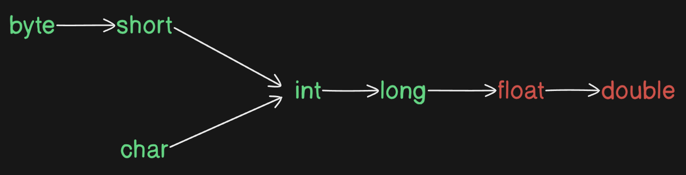

## **Content**

1. Increment and Decrement Operators
2. Arithmetic Operators
3. String Concatenation Operator
4. Relational Operators
5. Equality Operators
6. instanceof Operator
7. Bitwise Operators
8. Short Circuit Operators
9. Type Cast Operator
10. Assignment Operators
11. Conditional Operator
12. new Operator
13. [] Operator
14. Operator Precedence
15. Evaluation Order of Operands
16. new Vs newInstance()
17. instanceof Vs isInstance()
18. ClassNotFoundException Vs NoClassDefFoundError

---

## **Increment and Decrement Operators in Java**  

### **Increment Operators**  
- **Pre-Increment (`++x`)**: Increments the value of `x` **before** using it.  
  - Example: `y = ++x;`  
- **Post-Increment (`x++`)**: Uses the value of `x` **first**, then increments it.  
  - Example: `y = x++;`  

### **Decrement Operators**  
- **Pre-Decrement (`--x`)**: Decrements the value of `x` **before** using it.  
  - Example: `y = --x;`  
- **Post-Decrement (`x--`)**: Uses the value of `x` **first**, then decrements it.  
  - Example: `y = x--;`  

### **Expression Evaluation Table**  
| Expression | Initial `x` | `y` Value | Final `x` |  
|------------|------------|-----------|-----------|  
| `y = ++x;` | 10         | 11        | 11        |  
| `y = x++;` | 10         | 10        | 11        |  
| `y = --x;` | 10         | 9         | 9         |  
| `y = x--;` | 10         | 10        | 9         |  

---

## **Rules and Restrictions**  

### **1. Operators Can Only Be Applied to Variables**  
- The increment (`++`) and decrement (`--`) operators **cannot** be applied to constant values.  
- Trying to apply them to constants results in a **compile-time error**.  

#### **Valid Example:**  
```java
int x = 10;  
int y = ++x;  
System.out.println(y); // Output: 11  
```

#### **Invalid Example:**  
```java
int y = ++10; // Compilation Error  
System.out.println(y);  
```
**Error:**  
```
CE: Unexpected type  
Found: Value  
Required: Variable  
```

---

### **2. Nesting of Increment/Decrement Operators is Not Allowed**  
- You **cannot** nest increment or decrement operators.  

#### **Invalid Example:**  
```java
int x = 10;  
int y = ++(++x); // Compilation Error  
System.out.println(y);  
```
**Error:**  
```
CE: Unexpected type  
Required: Variable  
Found: Value  
```

---

### **3. Increment/Decrement Cannot Be Applied to `final` Variables**  
- A `final` variable **cannot** be modified after initialization.  
- Using `++` or `--` on a `final` variable results in a **compile-time error**.  

#### **Invalid Example:**  
```java
final int x = 10;  
x++; // Compilation Error  
System.out.println(x);  
```
**Error:**  
```
CE: Cannot assign a value to final variable x  
```

---

### **4. Applicability to Primitive Types**  
- **The `++` and `--` operators can be applied to all primitive types except `boolean`.**  

#### **Valid Examples:**  
```java
int x = 10;  
char ch = 'a';  
double d = 10.5;  

x++;        // x becomes 11  
ch++;       // ch becomes 'b'  
d++;        // d becomes 11.5  

System.out.println(x);  // 11  
System.out.println(ch); // b  
System.out.println(d);  // 11.5  
```

#### **Invalid Example (Boolean):**  
```java
boolean b = true;  
b++; // Compilation Error  
System.out.println(b);  
```
**Error:**  
```
CE: Bad operand type boolean for unary operator '++'  
```

---

## **Difference Between `b + 1` and `b++`**  

### **1. Arithmetic Operations (`b + 1`)**  
- When using an arithmetic operation (`+`), the result type is **max(int, type of operand1, type of operand2)**.  
- Since `b + 1` results in an `int`, an explicit type cast is required for smaller data types like `byte`.  

#### **Invalid Example:**  
```java
byte b = 10;  
b = b + 1; // Compilation Error  
System.out.println(b);  
```
**Error:**  
```
CE: Possible loss of precision  
Found: int  
Required: byte  
```

#### **Fix with Explicit Casting:**  
```java
byte b = 10;  
b = (byte) (b + 1);  
System.out.println(b); // Output: 11  
```

---

### **2. Internal Type Casting in `b++`**  
- The `++` operator performs an **implicit type cast**, so no explicit casting is required.  

#### **Valid Example:**  
```java
byte b = 10;  
b++;  
System.out.println(b); // Output: 11  
```

#### **Equivalent to:**  
```java
byte b = 10;  
b = (byte) (b + 1);  
System.out.println(b); // Output: 11  
```

---

## **Example Program**  
```java
class Test {  
    public static void main(String[] args) {  
        byte a = 10;  
        byte b = 20;  
        byte c = (byte) (a + b);  
        System.out.println(c); // Output: 30  
    }  
}  
```



## **Arithmetic Operators in Java**  

### **1. Rule for Type Promotion in Arithmetic Operations**  
When applying any **arithmetic operator** (`+`, `-`, `*`, `/`, `%`) between two variables `a` and `b`, the result type is determined by:  

$$
\text{Result Type} = \max(\text{int}, \text{Type of } a, \text{Type of } b)
$$

This means:  
- If both `a` and `b` are smaller than `int` (e.g., `byte` or `short`), they are **promoted to `int`** before performing the operation.  
- If `a` or `b` is `long`, the result is `long`.  
- If `a` or `b` is `float`, the result is `float`.  
- If `a` or `b` is `double`, the result is `double`.  

---

### **2. Type Promotion Hierarchy in Arithmetic Operations**  
In Java, **implicit type promotion** follows this order:  

```
byte → short → int → long → float → double
char (converted to int when used in arithmetic)
```
---

### **3. Examples of Arithmetic Operations & Type Promotions**  

### **Example 1: Byte Addition (byte + byte → int)**  
```java
byte a = 10;  
byte b = 20;  
int result = a + b;  // Both a and b promoted to int
System.out.println(result); // Output: 30
```


---

### **Example 2: Byte and Long (byte + long → long)**  
```java
byte a = 10;  
long b = 20L;  
long result = a + b;  // byte is promoted to long
System.out.println(result); // Output: 30
```


---

### **Example 3: Short and Short (short + short → int)**  
```java
short a = 10;  
short b = 20;  
int result = a + b;  // Both short values are promoted to int
System.out.println(result); // Output: 30
```
 

---

### **Example 4: Long and Double (long + double → double)**  
```java
long a = 10L;  
double b = 20.5;  
double result = a + b;  // long is promoted to double
System.out.println(result); // Output: 30.5
```

---

### **Example 5: Char and Char (char + char → int)**  
```java
char a = 'A';  // ASCII 65  
char b = 'B';  // ASCII 66  
int result = a + b;  
System.out.println(result); // Output: 131 (65 + 66)
```


---

### **Example 6: Char and Double (char + double → double)**  
```java
char a = 'A';  // ASCII 65  
double b = 0.5;  
double result = a + b;  
System.out.println(result); // Output: 65.5
```

---

## **Type Promotion in Java Arithmetic Operations**  

## **1. Implicit Type Promotion Rules**  

In Java, when performing arithmetic operations between different data types, smaller data types are automatically promoted to larger data types to maintain precision and prevent data loss.  

| **Expression**          | **Result Type** | **Explanation**                          |
|-------------------------|----------------|------------------------------------------|
| `byte + byte`          | `int`          | `byte` values are promoted to `int`. |
| `byte + short`         | `int`          | `byte` and `short` are promoted to `int`. |
| `short + short`        | `int`          | Both `short` values are promoted to `int`. |
| `byte + long`          | `long`         | `byte` is promoted to `long`. |
| `long + double`        | `double`       | `long` is promoted to `double`. |
| `float + long`         | `float`        | `long` is promoted to `float`. |
| `char + char`          | `int`          | `char` is promoted to `int`. |
| `char + double`        | `double`       | `char` is promoted to `int`, then to `double`. |

---

### **2. Explanation of Character Promotions**  
- In Java, `char` data type is stored as a Unicode integer value.  
- When `char` is used in arithmetic operations, it is automatically promoted to `int`.  
- If a `char` is combined with a floating-point number, it is further promoted to `double`.  

---

### **3. Example Calculations**  

### **Character Addition (`char + char`)**
```java
System.out.println('a' + 'b');  
```
**Explanation:**  
- Unicode values: `'a' = 97`, `'b' = 98`  
- Calculation: `97 + 98 = 195`  
- **Output:** `195`  

---

### **Character with Floating Point (`char + double`)**
```java
System.out.println('a' + 0.89);  
```
**Explanation:**  
- Unicode value: `'a' = 97`  
- Calculation: `97 + 0.89 = 97.89`  
- **Output:** `97.89`  

---

### **4. Type Promotion Hierarchy**  

When different data types are involved in operations, Java follows the following promotion order:  

```
byte → short → int → long → float → double
char (promoted to int if used in arithmetic operations)
```
- If any operand is of a higher type, the lower type is **automatically promoted** to match it.  
- This ensures precision and prevents unintended data loss.  
---

## **Infinity and NaN in Java Arithmetic**

## **1. Infinity in Java Arithmetic**
### **1.1 Integral Arithmetic (byte, short, int, long)**
- In **integral arithmetic**, there is **no way to represent infinity**.
- If an operation results in **infinity**, Java throws an **ArithmeticException** (`/ by zero`).
- This occurs only with the **division (`/`) and modulus (`%`) operators**.

#### **Example: Integral Division by Zero**
```java
System.out.println(10 / 0);  // Runtime Exception: ArithmeticException: / by zero
System.out.println(0 / 0);   // Runtime Exception: ArithmeticException: / by zero
```

---

### **1.2 Floating-Point Arithmetic (float, double)**
- **Floating-point numbers (`float` and `double`) can represent infinity**.
- Java provides **two constants** in `Float` and `Double` classes:
  ```java
  public static final double POSITIVE_INFINITY;
  public static final double NEGATIVE_INFINITY;
  ```
- Instead of throwing an exception, floating-point arithmetic results in **`Infinity`** or **`NaN`**.

#### **Example: Floating-Point Infinity**
```java
System.out.println(10 / 0.0);   // Output: Infinity
System.out.println(-10 / 0.0);  // Output: -Infinity
```

---

## **2. NaN (Not a Number) in Java Arithmetic**
### **2.1 Undefined Results in Integral Arithmetic**
- In **integral arithmetic**, undefined operations (e.g., `0 / 0`) result in **ArithmeticException**.

#### **Example:**
```java
System.out.println(0 / 0);  // Runtime Exception: ArithmeticException: / by zero
```

---

### **2.2 Undefined Results in Floating-Point Arithmetic**
- In **floating-point arithmetic**, undefined results are represented by **NaN (Not a Number)**.
- Java provides a constant for this in `Float` and `Double` classes:
  ```java
  public static final double NaN;
  ```

#### **Example: Floating-Point Undefined Results**
```java
System.out.println(0.0 / 0);   // Output: NaN
System.out.println(0 / 0.0);   // Output: NaN
System.out.println(0.0 % 0);   // Output: NaN
System.out.println(0.0 % 0.0); // Output: NaN
```

---

## **3. Behavior of NaN in Comparisons**
- **Any comparison involving `NaN` returns `false`**, except `x != NaN`, which returns `true`.

#### **Example: NaN Comparisons**
```java
class Test {
    public static void main(String[] args) {
        System.out.println(10 < Float.NaN);  // false
        System.out.println(10 <= Float.NaN); // false
        System.out.println(10 > Float.NaN);  // false
        System.out.println(10 >= Float.NaN); // false
        System.out.println(10 == Float.NaN); // false
        System.out.println(10 != Float.NaN); // true
        System.out.println(Float.NaN != Float.NaN); // true
    }
}
```

---

## **5. Arithmetic Exception in Java**
1. **ArithmeticException occurs only at runtime, not at compile-time.**
2. **Occurs only in integral arithmetic (`byte`, `short`, `int`, `long`) and not in floating-point arithmetic.**
3. **Only division (`/`) and modulus (`%`) can cause an ArithmeticException.**

#### **Example: Division and Modulus Causing ArithmeticException**
```java
System.out.println(10 / 0);  // ArithmeticException: / by zero
System.out.println(10 % 0);  // ArithmeticException: / by zero
```

---
