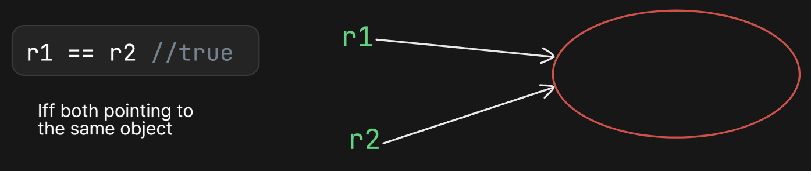

## **`+` Operator**

### **1. Overloaded `+` Operator**
- The **only overloaded operator in Java** is the `+` operator.
  1. **Arithmetic Addition Operator** (when used with numbers).
  2. **String Concatenation Operator** (when at least one operand is a `String`).

---

### **2. Behavior of `+` Operator**
### **2.1 Arithmetic Addition**
- When **both operands are numbers**, `+` performs **arithmetic addition**.


```java
System.out.println(10 + 20); // Output: 30
```

---

### **2.2 String Concatenation**
- If **at least one operand is a `String`**, `+` performs **concatenation**.

```java
System.out.println("ab" + "cd"); // Output: abcd
```

---

### **2.3 Mixed Operands (String + Number)**
- If one operand is a `String`, **all subsequent additions follow string concatenation**.


```java
String a = "durga";
int b = 10, c = 20, d = 30;

System.out.println(a + b + c + d);  // Output: durga102030
System.out.println(b + c + d + a);  // Output: 60durga
System.out.println(b + c + a + d);  // Output: 30durga30
System.out.println(b + a + c + d);  // Output: 10durga2030
```


- `a + b + c + d` → `"durga" + 10 → "durga10" + 20 → "durga1020" + 30 → "durga102030"`
- `b + c + d + a` → `10 + 20 → 30 + 30 → 60 + "durga" → "60durga"`
- `b + c + a + d` → `10 + 20 → 30 + "durga" → "30durga" + 30 → "30durga30"`
- `b + a + c + d` → `10 + "durga" → "10durga" + 20 → "10durga20" + 30 → "10durga2030"`

---

## **3. Valid and Invalid Assignments**
### **Variable Declarations**
```java
String a = "durga";  
int b = 10, c = 20, d = 30;
```

### **Evaluation of Assignments**
| **Expression**      | **Result**      | **Reason**  |
|---------------------|----------------|-------------|
| `a = b + c + d;`   | **CE**       | Incompatible types (int to String) |
| `a = a + b + c;`   | **Valid**    | `"durga" + 10 → "durga10" + 20 → "durga1020"` |
| `b = a + b + c;`   | **CE**       | Incompatible types (String to int) |
| `b = b + c + d;`   | **Valid**    | `10 + 20 → 30 + 30 → 60` |
| `b = b + c + d;`   | **Valid**    | Same as above (redundant) |

**CE:** Compilation Error

---


## **Relational Operators in Java**

### **Definition**  
Relational operators are used to compare two values. They return a boolean result (`true` or `false`). These operators can be applied to all primitive data types **except boolean** and **cannot be used with objects**.

---

### **Types of Relational Operators**  

1. **Greater than (`>`)** – Checks if the left operand is greater than the right operand.  
2. **Less than (`<`)** – Checks if the left operand is less than the right operand.  
3. **Greater than or equal to (`>=`)** – Checks if the left operand is greater than or equal to the right operand.  
4. **Less than or equal to (`<=`)** – Checks if the left operand is less than or equal to the right operand.  

---

### **Examples of Relational Operators**

#### **1. Comparing Numeric Values**  
```java
System.out.println(10 < 20);
```
**Output:** `true`  

```java
System.out.println(15 > 25);
```
**Output:** `false`  

---

#### **2. Comparing Character Values (Using Unicode)**  
Java compares character values based on their Unicode values.

```java
System.out.println('a' > 'A');  // Unicode of 'a' is 97, 'A' is 65
```
**Output:** `true`  

```java
System.out.println('z' < 'Z');  // Unicode of 'z' is 122, 'Z' is 90
```
**Output:** `false`  

---

#### **3. Comparing Characters with Numbers**
```java
System.out.println('a' < 100);  // Unicode of 'a' is 97
```
**Output:** `true`  

```java
System.out.println('b' > 98);  // Unicode of 'b' is 98
```
**Output:** `false`  

---

#### **4. Applying Relational Operators on Boolean Values (Not Allowed)**
Relational operators **cannot be applied to boolean values**.  

```java
System.out.println(true > false);
```
**Error:** `operator > cannot be applied to boolean`  

---

#### **5. Applying Relational Operators on Strings (Not Allowed)**
Relational operators **cannot be used on objects like Strings**.  

```java
System.out.println("apple" > "banana");
```
**Error:** `operator > cannot be applied to java.lang.String, java.lang.String`  

---

### **Important Rules and Limitations**

1. **Relational operators can be used with numeric values and characters but not with boolean or objects.**  
2. **Comparison of different primitive types is allowed; smaller types are promoted to larger types before comparison.**  
   ```java
   int x = 5;
   double y = 5.0;
   System.out.println(x <= y);  // int is promoted to double before comparison
   ```
   **Output:** `true`  
3. **String comparison using relational operators is not allowed in Java.**  
4. **Nesting of relational operators is not allowed in Java.**  

   ```java
   System.out.println(10 < 20 < 30);
   ```
   **Error:** `operator < cannot be applied to boolean, int`  

---

### **Alternative Ways to Compare Strings and Objects**

Since relational operators cannot be used with objects like Strings and Dates, Java provides methods like `.compareTo()` and `.isBefore()`.  

#### **1. Comparing Strings Using `.compareTo()`**
```java
String str1 = "apple";
String str2 = "banana";
System.out.println(str1.compareTo(str2));  // Returns a negative value since "apple" < "banana"
```
**Output:** `-1`  

---

#### **2. Comparing Dates Using `.isBefore()`**
```java
import java.time.LocalDate;

LocalDate date1 = LocalDate.of(2023, 1, 1);
LocalDate date2 = LocalDate.of(2024, 1, 1);
System.out.println(date1.isBefore(date2));  // true
```
**Output:** `true`  

---

## **Equality Operators in Java**  

#### **Definition**  
Equality operators are used to compare two values for equality or inequality. They return a boolean result (`true` or `false`). These operators can be applied to **all primitive types, including boolean**, and **can also be used for object references**.  

#### **Types of Equality Operators**  
1. **Equal to (`==`)** – Returns `true` if both operands are equal.  
2. **Not equal to (`!=`)** – Returns `true` if both operands are not equal.  

---

### **Examples of Equality Operators on Primitive Types**  

#### **1. Comparing Numeric Values**  
```java
System.out.println(10 == 20);
```
**Output:** `false`  

```java
System.out.println(5 != 10);
```
**Output:** `true`  

---

#### **2. Comparing Character Values**  
```java
System.out.println('a' == 'b');  // Unicode of 'a' is 97, 'b' is 98
```
**Output:** `false`  

```java
System.out.println('a' == 97.0);  // Unicode of 'a' is 97, promoted to double before comparison
```
**Output:** `true`  

---

#### **3. Comparing Boolean Values**  
Equality operators **can** be applied to boolean values.  

```java
System.out.println(false == false);
```
**Output:** `true`  

```java
System.out.println(true != false);
```
**Output:** `true`  

---

### **Equality Operators on Object References**  

- Equality operators can be applied to **objects**.  
For object references `r1` and `r2`, `r1 == r2` returns `true` **if and only if both references point to the same object in memory** (this is known as **reference comparison or address comparison**).  
---

---

#### **Example: Comparing Object References**  
```java
Thread k1 = new Thread();
Thread k2 = new Thread();
Thread k3 = k1;

System.out.println(k1 == k2);  // k1 and k2 are different objects
```
**Output:** `false`  

```java
System.out.println(k1 == k3);  // k1 and k3 refer to the same object
```
**Output:** `true`  

---

### **Key Points About Equality Operators**  
1. **Equality operators work on all primitive types, including boolean.**  
2. **They can also be used with object references for reference comparison.**  
3. **For objects, `==` checks if two references point to the same memory location, not if they contain the same data.**  
4. **To compare object contents (not references), use the `.equals()` method instead of `==`.**  

#### **Example: Comparing Object Contents Using `.equals()`**  
```java
String str1 = new String("Java");
String str2 = new String("Java");

System.out.println(str1 == str2);      // false (different objects)
System.out.println(str1.equals(str2)); // true (same content)
```
**Output:**  
```
false
true
```

---

### **Equality Operator for Object Types**

If we apply the equality (`==`) operator for object types, there must be some relationship between the argument types (either **child-to-parent, parent-to-child, or the same type**). Otherwise, we will get a **compile-time error** saying "incomparable types."


```java
class Test {  
    public static void main(String[] args) {  
        Thread t = new Thread();  
        Object o = new Object();  
        String s = new String("durga");  

        System.out.println(t == o); // false  
        System.out.println(o == s); // false  
        System.out.println(s == t); // CE: incomparable types  
    }  
}  
```
---

### **Difference Between `==` Operator & `equals()` Method**

In general, we can use the `==` operator for reference comparison (address comparison) and `.equals()` for content comparison.

```java
String s1 = new String("durga");
String s2 = new String("durga");
System.out.println(s1 == s2);       // Reference comparison
System.out.println(s1.equals(s2));  // Content comparison
```

### **Note**
- For an object reference `r`, the expression `r == null` evaluates to **false** if `r` refers to a valid object.
- However, `null == null` is always **true**.

### Example Code:

```java
String s = new String("durga");  
System.out.println(s == null); // false  

String s = null;  
System.out.println(s == null); // true  

System.out.println(null == null); // true  
