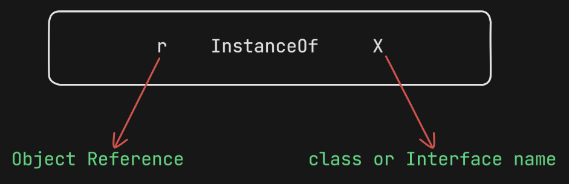

## **`instanceof` Operator**

### **What is `instanceof`?**
- The `instanceof` operator is used to check whether a given object is an instance of a particular class or interface.
- It returns **true** if the object belongs to the specified type; otherwise, it returns **false**.

---

### **Basic Usage Example:**
```java
Object o = r.get(0);  
if (o instanceof Student) {  
    Student s = (Student) o;  
    // Perform Student-specific functionality  
} else if (o instanceof Customer) {  
    Customer c = (Customer) o;  
    // Perform Customer-specific functionality  
}  
```



---

### **Example 1: `instanceof` with Thread Class**
```java
Thread k = new Thread();  
System.out.println(k instanceof Thread);   // true  
System.out.println(k instanceof Object);   // true  
System.out.println(k instanceof Runnable); // true  
```
### **Explanation:**
- `k instanceof Thread` → **true** (since `k` is a `Thread` object).
- `k instanceof Object` → **true** (since `Thread` is a subclass of `Object`).
- `k instanceof Runnable` → **true** (since `Thread` implements `Runnable`).

---

### **Rules for Using `instanceof`**
### **Valid Usage:**
- `instanceof` works when there is a valid relationship between the types:
  - **Child-to-parent**
  - **Parent-to-child**
  - **Same type**

### **Invalid Usage:**
- If there is **no relationship** between the types, we get a **compile-time error**:  
  `"CE: inconvertible types"`

#### **Example of Compile-Time Error:**
```java
Thread k = new Thread();  
System.out.println(k instanceof String);  // CE: incompatible types  
// Error: Thread cannot be compared with String  
```

---

### **Example 2: Complete Java Program**
```java
class Test {  
    public static void main(String[] args) {  
        Thread t = new Thread();  
        System.out.println(t instanceof Thread);   // true  
        System.out.println(t instanceof Object);   // true  
        System.out.println(t instanceof Runnable); // true  
    }  
}  
```
### **Explanation:**
- `t` is an instance of `Thread`, so it returns **true**.
- `Thread` extends `Object`, so `t instanceof Object` returns **true**.
- `Thread` implements `Runnable`, so `t instanceof Runnable` returns **true**.

---

### **Special Case: `null instanceof` is Always False**
- For any class or interface, `null instanceof X` **always evaluates to false**.

#### **Example:**
```java
class Test {  
    public static void main(String[] args) {  
        System.out.println(null instanceof Thread);   // false  
        System.out.println(null instanceof Object);   // false  
        System.out.println(null instanceof Runnable); // false  
    }  
}  
```
### **Explanation:**
- `null` does not belong to any class or interface.
- As a result, any `instanceof` check involving `null` always returns **false**.

---
✅ The `instanceof` operator is used to check whether an object belongs to a particular type.  
✅ It returns `true` if there is a valid relationship between the types.  
❌ If there is no relation between the types, a **compile-time error** occurs.  
❌ `null instanceof X` **always returns false**.  

---


## **Bitwise and Boolean Operators in Java**

## **1. Bitwise Operators (`&`, `|`, `^`)**
- These operators are **applicable to both** **boolean** and **integral types**.
- When used with **boolean values**, they perform **logical operations**.
- When used with **integral values**, they perform **bitwise operations**.

### **1.1 Bitwise Operators for Boolean Values**
| Operator | Name  | Description |
|----------|-------|-------------|
| `&`  | AND  | Returns `true` if **both** operands are `true`. |
| `|`  | OR   | Returns `true` if **at least one** operand is `true`. |
| `^`  | XOR  | Returns `true` if **operands are different**. |

#### **Example:**
```java
System.out.println(true & false);  // false  
System.out.println(true | false);  // true  
System.out.println(true ^ false);  // true  
```

---

### **1.2 Bitwise Operators for Integral Values**
```java
System.out.println(4 & 5);  // 4  
System.out.println(4 | 5);  // 5  
System.out.println(4 ^ 5);  // 1  
```

#### **Binary Representation of Operations:**
```
  100  (4 in binary)
& 101  (5 in binary)
------
  100  (Result: 4)

  100  
| 101  
------  
  101  (Result: 5)

  100  
^ 101  
------  
  001  (Result: 1)
```

---

## **2. Bitwise Complement Operator (`~`)**
- The **bitwise complement operator** (`~`) **inverts** all bits of an integer.
- This operator is **only applicable to integral types** (`byte`, `short`, `int`, `long`).
- **Not applicable to boolean values** → results in a **compile-time error**.

#### **Example:**
```java
System.out.println(~true); // CE: operator ~ cannot be applied to boolean  
System.out.println(~4);    // -5  
```

#### **Binary Representation:**
```
  4   ≡  0000 0000 0000 0100  (Binary representation of 4)
         ↓  
       (Sign Bit)  

~4  ≡  1111 1111 1111 1011  (Inverted bits)
              ↓  
         (2's Complement Representation)  

   0000 0000 0000 1011  
   0000 0000 0000 0101  (Final value: -5)
```

### **Key Points:**
- The **most significant bit (MSB)** acts as a **sign bit**:
  - `0` → **Positive number**
  - `1` → **Negative number**
- **Positive numbers** are stored directly in memory.
- **Negative numbers** are stored in **two’s complement form**.
- The value of `~n` is calculated as:
  ```
  ~n = -(n + 1)
  ```
  Example:
  ```
  ~4 = -(4 + 1) = -5
  ```

---

## **3. Boolean Complement Operator (`!`)**
- The **Boolean complement operator** (`!`) is used to **negate** a boolean value.
- It is **only applicable to boolean types**.
- **Not applicable to integral values** → results in a **compile-time error**.

#### **Example:**
```java
System.out.println(!false); // true  
System.out.println(!true);  // false  
System.out.println(!4);     // CE: operator ! cannot be applied to int  
```

---

## **4. Summary Table of Operators**
| Operator | Applicable To | Description |
|----------|--------------|-------------|
| `&`, `|`, `^` | **Boolean & Integral Types** | Used for **bitwise** and **logical** operations. |
| `~` | **Only Integral Types** | Bitwise **complement** (inverts all bits). |
| `!` | **Only Boolean Types** | Boolean **negation** (flips `true`/`false`). |

---

## **5. Additional Key Points**
### ✅ **Bitwise vs Logical Operators**
- `&` and `|` can be used for **both** bitwise and logical operations.
- However, Java also provides **logical operators** (`&&`, `||`) which work **only on boolean values**:
  ```java
  System.out.println(true && false);  // false  
  System.out.println(true || false);  // true  
  ```
- **Difference Between `&` and `&&`**
  - `&` **evaluates both operands** (even if the first one is false).
  - `&&` **short-circuits** (if the first operand is false, the second is not evaluated).

### ✅ **Use Cases of `instanceof` with Bitwise Operators**
- **`instanceof` cannot be used with bitwise operators.**
- Example:
  ```java
  Object obj = new String("Hello");
  System.out.println(obj instanceof String);  // true
  System.out.println(obj instanceof Integer); // false
  ```
- **`instanceof` only checks type compatibility, not bitwise operations.**

### ✅ **Performance Considerations**
- **Bitwise operators (`&`, `|`, `^`, `~`)** are **faster** than arithmetic operations.
- **Use bitwise operations for performance optimizations** in low-level programming, such as:
  - **Bit manipulation** for performance optimization.
  - **Setting, clearing, and toggling bits** in embedded systems.
  - **Bitwise masks** for permissions handling.

---

## **6. Practical Examples**
### **Example 1: Checking Even or Odd Using Bitwise AND**
```java
int num = 10;
if ((num & 1) == 0) {
    System.out.println("Even");
} else {
    System.out.println("Odd");
}
```
**Explanation:**  
- If the **least significant bit (LSB)** is `0`, the number is even.
- If the **LSB** is `1`, the number is odd.

### **Example 2: Swapping Two Numbers Using XOR**
```java
int a = 5, b = 7;
a = a ^ b;
b = a ^ b;
a = a ^ b;
System.out.println("a: " + a + ", b: " + b); // a: 7, b: 5
```
**Explanation:**  
- XOR is used for **swapping values without a temporary variable**.

---
