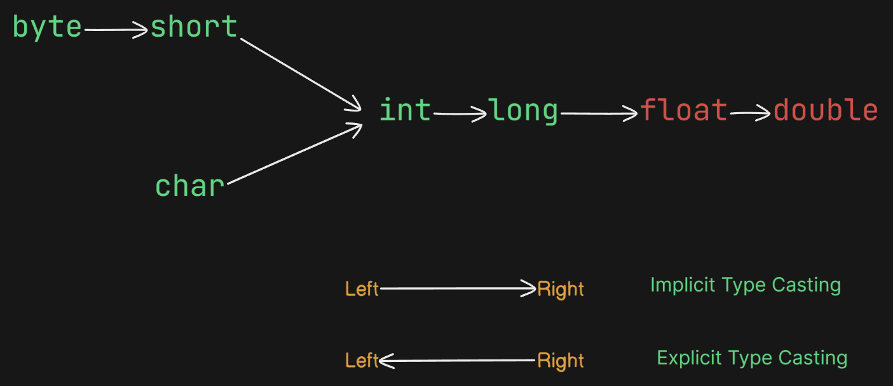

## **Short-Circuit Operators**

## **Difference Between Bitwise and Short-Circuit Operators**

---

### **Bitwise Operators (`&`, `|`)**
1. Both arguments are **always evaluated**.
2. **Performance is relatively low** due to mandatory evaluation.
3. Applicable for both **boolean and integral types**.

---

### **Short-Circuit Operators (`&&`, `||`)**
1. Evaluation of the second argument is **optional**.
2. **Performance is relatively high** as it may skip unnecessary evaluations.
3. Applicable **only for boolean types**, not for integral types.

---

## **Important Notes:**
1. **`x && y`**  
   - `y` is evaluated **only if** `x` is `true`.  
   - If `x` is `false`, `y` will **not** be evaluated.  

2. **`x || y`**  
   - `y` is evaluated **only if** `x` is `false`.  
   - If `x` is `true`, `y` will **not** be evaluated.  

---

## **Question**

### **Original Code:**
```c
int x = 10, y = 15;

if (++x < 10 || ++y > 15) 
{
    x++;
}
else 
{
    y++;
}
printf("%d, %d", x, y);
```

---

### **Analysis Table:**

| **Operator** | **Condition Evaluation**                              | **x After Condition** | **y After Condition** | **Block Executed** | **Final x** | **Final y** | **Output** |
|--------------|-------------------------------------------------------|-----------------------|-----------------------|--------------------|-------------|-------------|------------|
| `&` (Bitwise AND) | `++x < 10` (11 < 10, False), `++y > 15` (16 > 15, True), `False & True = False` | 11                   | 16                   | `else` (y++)       | 11          | 17          | `11, 17`   |
| `&&` (Logical AND) | `++x < 10` (11 < 10, False), short-circuit, `y` unchanged | 11                   | 15                   | `else` (y++)       | 11          | 16          | `11, 16`   |
| `|` (Bitwise OR)  | `++x < 10` (11 < 10, False), `++y > 15` (16 > 15, True), `False | True = True` | 11                   | 16                   | `if` (x++)         | 12          | 16          | `12, 16`   |
| `||` (Logical OR) | `++x < 10` (11 < 10, False), `++y > 15` (16 > 15, True), `False || True = True` | 11                   | 16                   | `if` (x++)         | 12          | 16          | `12, 16`   |

---

### **Table Notes:**
1. **Initial Values:** `x = 10`, `y = 15`.
2. **Condition Breakdown:**
   - `++x < 10`: Increments `x` to 11, then checks if `11 < 10` (False).
   - `++y > 15`: Increments `y` to 16, then checks if `16 > 15` (True).
3. **Operator Behavior:**
   - `&` (Bitwise AND): Evaluates both sides, no short-circuiting.
   - `&&` (Logical AND): Short-circuits if the first condition is False.
   - `|` (Bitwise OR): Evaluates both sides, no short-circuiting.
   - `||` (Logical OR): Short-circuits if the first condition is True, but evaluates the second if the first is False.
4. **Block Executed:**
   - `if` block: `x++` increments `x` by 1.
   - `else` block: `y++` increments `y` by 1.

---

### **Final Answer for Original Code (`||`):**
The output is: **`12, 16`**.

---

```java
int x = 10;

if (++x < 10 && (x/0 > 10)) {
    System.out.println("Hello");
} else {
    System.out.println("Hi");
}
```

#### Execution Flow:
1. **Initialization**: 
   - `int x = 10;` assigns 10 to variable `x`.
2. **Increment**: 
   - `++x` pre-increments `x`, so `x` becomes 11.
3. **Condition Evaluation**: 
   - First part: `11 < 10` evaluates to `false`.
   - Logical operator is `&&` (short-circuit AND).
   - Since the first condition is `false`, the second condition `(x/0 > 10)` is not evaluated due to short-circuiting.
4. **Result**: 
   - The `if` block is skipped, and the `else` block executes.
   - Output: `"Hi"`.

#### Output Options:
- (1) CE (Compilation Error): Incorrect, as the code compiles successfully.
- (2) RE: AE: / by zero (Runtime Exception: ArithmeticException): Incorrect, as short-circuiting prevents division by zero.
- (3) Hello: Incorrect, as the `if` condition is false.
- (4) Hi: Correct, as the `else` block executes.

#### Modified Code (Replacing `&&` with `&`):
```java
int x = 10;

if (++x < 10 & (x/0 > 10)) {
    System.out.println("Hello");
} else {
    System.out.println("Hi");
}
```

#### Modified Execution Flow:
1. **Initialization**: 
   - `int x = 10;` assigns 10 to `x`.
2. **Increment**: 
   - `++x` pre-increments `x`, so `x` becomes 11.
3. **Condition Evaluation**: 
   - First part: `11 < 10` evaluates to `false`.
   - Logical operator is `&` (bitwise AND, non-short-circuiting).
   - Both conditions are evaluated, so `(x/0 > 10)` is executed.
   - `x/0` causes a division by zero.
4. **Result**: 
   - Runtime Exception: ArithmeticException: / by zero occurs.
   - Output: (2) RE: AE: / by zero.

#### Key Difference:
- `&&` (short-circuit AND): Evaluates the second condition only if the first is true.
- `&` (bitwise AND): Always evaluates both conditions, leading to the runtime exception in this case.

---

### Type Casting in Java

#### 1. Implicit Type Casting
- **Definition**: Automatic conversion performed by the compiler.
- **Condition**: Occurs when a smaller data type value is assigned to a larger data type variable.
- **Alternative Names**: Widening or Upcasting.
- **Responsibility**: Handled by the compiler.
- **Data Loss**: No loss of information occurs.
- **Possible Conversions**:
  - `byte` → `short` → `int` → `long` → `float` → `double`
  - `char` → `int`
- **Examples**:
  ```java
  int x = 'a';          // char to int (ASCII value of 'a' is 97)
  System.out.println(x); // Output: 97

  double d = 10;        // int to double
  System.out.println(d); // Output: 10.0
  ```

### **Explicit Type Casting**  

- **Definition**: Explicit type casting is a manual conversion performed by the programmer using a cast operator.  
- **Condition**: It occurs when a larger data type value is assigned to a smaller data type variable.  
- **Alternative Names**: This process is also known as narrowing or downcasting.  
- **Responsibility**: The programmer is responsible for explicitly specifying the cast.  
- **Conversion**: It involves converting a larger data type to a smaller data type (e.g., `int` to `byte`).  
- **Data Loss**: Explicit casting may result in a loss of information due to the smaller range of the target data type.  
- **Syntax**: The syntax for explicit type casting follows the format `(targetType) value`.


- **Possible Conversions**:
  - `double` → `float` → `long` → `int` → `short` → `byte`
  - `int` → `char`
- **Examples**:
  ```java
  double d = 10.7;
  int x = (int) d;      // double to int (truncates decimal)
  System.out.println(x); // Output: 10

  int y = 97;
  char c = (char) y;    // int to char
  System.out.println(c); // Output: 'a'
  ```




---

### Example
1. First case (with error):
```java
int x = 130;
byte b = x;  // Compile-time error: possible loss of precision
```
- In Java, an `int` is 32 bits and ranges from -2,147,483,648 to 2,147,483,647
- A `byte` is 8 bits and ranges from -128 to 127
- Assigning an `int` to a `byte` directly causes a "possible loss of precision" error because the compiler knows some int values won't fit in a byte
- 130 is within int's range but outside byte's range (127 max)

2. Second case (working):
```java
int x = 130;
byte b = (byte) x;  // Explicit cast
System.out.println(b);  // Outputs: -126
```
Here's why you get -126:
- When you cast an int to a byte explicitly with `(byte)`, Java performs a narrowing conversion
- It keeps only the 8 least significant bits of the 32-bit int
- 130 in binary is: 00000000 00000000 00000000 10000010 (32 bits)
- After casting to byte (8 bits): 10000010
- In two's complement (how Java represents signed numbers):
  - 10000010 = -126
  - Calculation: 
    * First bit is 1 (negative)
    * Invert remaining bits: 0000010 = 2
    * Add 1: 2 + 1 = 3
    * Add negative sign: -3
    * But position starts at -128: -128 + 2 = -126

This overflow/wrapping behavior occurs because 130 > 127 (byte's max value), so it wraps around to the negative side of byte's range (-128 to 127).

----

### Example:
- **Code**:
  ```java
  int x = 150;  
  byte b = (byte) x;  
  System.out.println(b); // Should output: -106 
  ```

- **Binary Conversion**:
  - 150 ÷ 2 repeatedly (as shown on whiteboard):  
    150 → 75 (0) → 37 (1) → 18 (1) → 9 (0) → 4 (1) → 2 (0) → 1 (1) → 0  
    Binary (reading remainders bottom to top): `10010110`.

- **Casting to Byte**:
  - `int` 150 = `00000000 00000000 00000000 10010110` (32 bits).  
  - `byte` (8 bits): `10010110` (takes least significant 8 bits).

- **Two's Complement (Signed Byte)**:
  - `10010110`:  
    - Sign bit `1` = negative.  
    - Invert bits: `01101001` = 64 + 32 + 8 + 1 = 105.  
    - Add 1: 105 + 1 = 106.  
    - Negative: `-106`.  
  - Alternatively: `-128 + 64 + 16 + 4 + 2 = -128 + 86 = -106`.

- **Result**:
  - `System.out.println(b)` = `-106` (not -126 as written).

---

### Compact Explanation of Whiteboard Content

- **Code**:
  ```java
  double d = 130.856;
  int x = (int) d;
  System.out.println(x); // Outputs: 130
  byte b = (byte) d;
  System.out.println(b); // Outputs: ?
  ```

- **Step 1: `double` to `int`**:
  - `d = 130.856` (double, 64 bits).
  - `int x = (int) d`: Casting truncates decimal part.
  - `x = 130`.

- **Step 2: `double` to `byte`**:
  - `b = (byte) d`: Direct cast from `double` to `byte`:
    - First, `double` 130.856 → `int` 130 (truncates decimal).
    - Then, `int` 130 → `byte` (narrowing conversion).
  - Binary of 130: `10000010` (8 bits).
  - Two's complement (signed byte):
    - Sign bit `1` = negative.
    - Value: `-128 + 2 = -126`.

- **Output**:
  - `System.out.println(x)` = `130`.
  - `System.out.println(b)` = `-126` (whiteboard doesn't show this, but based on calculation).


---
- When casting a `double` to a `byte`, Java first truncates the decimal part to an `int`, then narrows it to a `byte` using two's complement for the final value.
---

